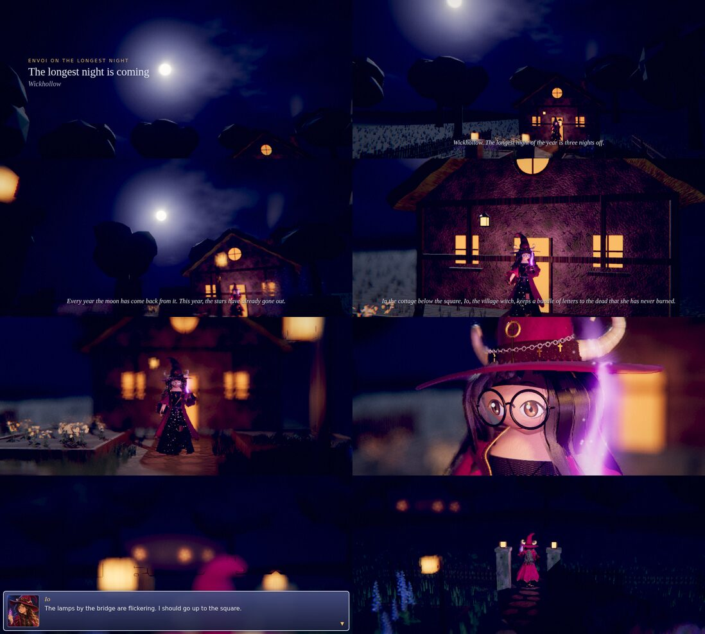
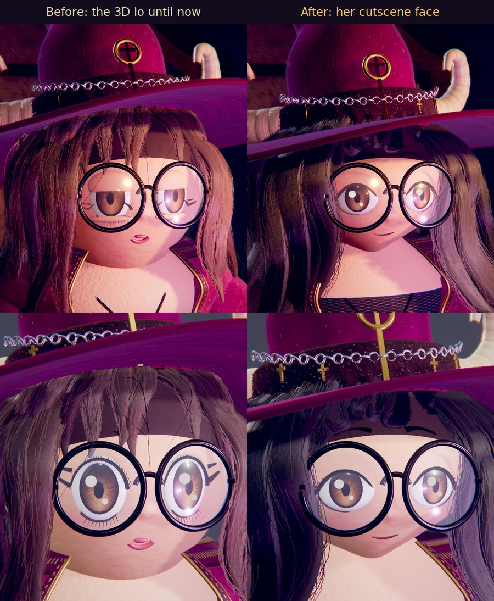

# 3D Cutscenes: a test

Claude's own folder, started October 4, 2026, when Chris asked whether the style of the Bramble Colossus film could make the game's cutscenes. Everything else in the repository is read here; nothing outside this folder is changed by it.

**The test:** https://claude.ai/artifact/EW9kf1efsPowncFRNqB5J2 (private). `Prologue_In_Ios_Garden.html` in this folder is the same page as one file.



In the test Io now has her cutscene face, made like her paper doll's ([below](#ios-face-in-cutscenes)).

## The short answer

Yes, it works, and the test above is the game's own prologue made that way. How easy each scene is depends on three things:

- **The camera and the film's look carry over as they are.** The Bramble film is a list of shots written as data (where the camera starts and ends, what it looks at, what is in focus, who moves, which words show), played by a small player, through the film camera (`cinema.js`: depth of field, bloom, moonlight shafts, a film grade, letterbox). This test uses the same camera unchanged and the same kind of shot list, extended to people who walk and talk.
- **The game's people are ready for it.** Every model in the game shares one interface, and the film player only uses that interface. The high-detail Io from `3d-model-main-characters/` plays here, with her face made like her paper doll's (below) and her own walk, idle and looking about. The game's own models (Sol, Halcyon, Noctara, Lunara, Envoi) can stand in the same light, as the Io study's side-by-side picture shows.
- **The places are the work.** A film camera that goes anywhere needs the place built in 3D all round. Two exist so far: Io's garden (`garden.js`, from the Io study) and the Frostmere meadow (`frostmere.js`, from the field study). The game's other places are paintings, which look right only from the one spot they were painted from.

So a scene in a place that exists is mostly a new shot list. A scene somewhere new needs that place built first, about as much work as the garden was. The townsfolk (Quill, Ysmera, the gnomes, Mayor Gretch) have no 3D models at all; they are paper dolls.

## What the test shows

- **The prologue,** with the game's own words from `src/game/script.js` (still placeholders for the lore conversation), in seven shots and about a minute: the moon in a sky with no stars, tilting down to Io small at her door (the picture art request 07 asks for in its first still), the empty sky, Io at her lit door, her walk down the path, her face in the lantern light, the lamps by the bridge flickering far off past the gate (one goes out), and Io out through the gate toward the square.
- **Io moving as the game keeps her,** with her cutscene face. She does only what the game's Io does: her idle, her walk and her looking about. The scene only says where she walks and when.
- **The game's dialogue box.** Narration shows as film captions; Io's line comes up in the game's own box with her painted portrait, and waits for a tap, as the game does. The camera holds and she keeps breathing while it waits. A **Skip** button ends the scene.
- **Sound** made in code, from the field study: wind in the trees and a tawny owl.
- **How fast it ran.** The end card says how many frames a second the phone drew, at which detail, and offers a lighter or sharper version.

New in the place, for the scene only: the open doorway's warm light (the garden draws it just behind the wall, where the wall hides it), and four distant lamps with a warm haze, the lamps by the bridge.

## Io's face in cutscenes



Chris asked (October 4, 2026) that any prologue or cutscene give Io a face as close as possible to her paper doll's, because a film's close-ups show her face, which the battles never do. So this folder has a cutscene Io, `io-cutscene.js`: the high-detail Io with her face, and the look round it, redone:

- her face narrows to a small chin instead of being a round ball;
- almond eyes with a heavy dark upper lash line that is the top of the eye, a flick at the outer corner and a fine lower line;
- thin dark brows just above her glasses, a small closed smile with a touch of rose, and rosier cheeks;
- her hat sits lower, its brim over bangs that sweep to one side and end at her brows;
- darker hair with an ash shine, wavier, with locks framing her face;
- her black top comes up to her collarbones, as on the paper doll.

Her bones, body, clothes and every move stay the same, so she walks, breathes, blinks and looks about exactly as before. **The battles keep the game's Io:** nothing outside this folder changes. The project's rule that the Witch's model keeps exactly how she looks still holds for the game; this face is for cutscenes only, at Chris's request. If Chris keeps it, `docs/design-decisions.md` should say so; this folder doesn't edit files outside itself.

Not done yet: the sheer veil that hangs from her hat's brim in the painted scenes, and the pointed ears the paper doll shows (the 3D Io has never had them, so that is Chris's call). Her quick blinks look right, but lids held lowered for a long time (sleepy or sad) still look a little puffy.

### Tried and dropped: a 3D Io built from a picture

On October 4 Chris turned his front view of Io (`art-requests/io-front.webp`) into a 3D model with Tripo, a site that builds 3D models from pictures. Even with its face repainted from his picture, she looked mushy, so Chris dropped the idea and the test was deleted.

## How a scene is written

`scenes.js` holds the prologue as a list of shots. One of them, as it is there:

```js
// down the path to her lantern
{ id: 'walk', d: 8, cam: { from: [0.45, 1.05, 3.9], to: [0.4, 1.2, 3.1], at: 'io.chest', fov: [30, 28], ease: 'o', shake: .1 },
  focus: 'io.chest', ap: .9, exp: 1.5, do: [[0.2, 'io', 'walk', [[0, -3.4], [0.05, -0.1]], 1.05]] },
```

That is: eight seconds; the camera eases from one point to another, looking at Io's chest, with a little handheld drift; focus on her; Io starts walking 0.2 s in, to two points on the path. Lines are `say: [[start, end, who, words, { hold }]]`, sounds are `sound: [[time, name, ...]]`, and moves are `do: [[time, who, 'play', move]]`. The player (`player.js`) does the rest.

## The game's other big moments

The nine story stills of art request 07, and what each would need as a 3D scene:

| Scene | Who | Their 3D models | The place in 3D |
|---|---|---|---|
| The longest night is coming (prologue) | Io | Yes | Yes: this test |
| Sol arrives | Io, Sol | Yes | No: the bridge and the square are paintings |
| Quill's skiff | Io, Sol, Quill | Quill: no; the Magpie: yes | No: the jetty |
| Bogmire's lights come home | Io, Sol, townsfolk | Townsfolk: no; flying lights are easy | No: Bogmire |
| Envoi is made | Io, Sol, Envoi | Yes, with Envoi's summon (the letters folding into the wyrm) | No: Dawnroost's node |
| Spared (after Halcyon) | Io, Sol, Halcyon | Yes, with kneel and Halcyon's retreat | No: the crossroads |
| The shipyard | Ysmera, the gnomes | No | No |
| The dead Moonwell | Noctara, Halcyon | Yes | No |
| The stars come back | Io, Sol, Lunara, moths | Yes; a sky with stars is easy | No: the square |

Six of the nine have all their people in 3D already: this test, and five that need only their place. The other three need people too, or a version without the townsfolk close up.

## Three ways to make the game's cutscenes

1. **Real 3D, played live, like this test.** It looks most like the film and costs the file very little: this whole page, with Io and her garden, is 0.38 MB; a new scene's shot list is a few KB; a new place is about 40 KB of code, as the garden is. What limits it is the phone's drawing power (below).
2. **The paintings, with the people in 3D in front of them.** The battles and the living battlefields already work this way, and most story places have a battle painting. The camera stays where the painter stood and can only zoom and pan, but the film camera's depth of field, glow and grade still apply, and it is light on a phone. Close-ups should work well, since a blurred painting behind a sharp face looks like a film.
3. **Recorded as video from the laptop version.** Every phone would show exactly the laptop picture, but video is several megabytes a minute, and the game's published page is already 13.6 MB of the 16 MB a page may be.

A mix is likely best: a few key scenes as in the test, in places worth building (the square, the crossroads, the dead Moonwell), and the rest over their paintings.

## Phones

| Detail | Io | Drawn each frame | Picture |
|---|---|---|---|
| Light | 153,000 triangles | about 0.95 million triangles | 70% sharpness, no lantern shadow |
| Phone (a phone's first choice) | 330,000 triangles | about 1.8 million triangles | 80% sharpness |
| Laptop | 1,231,000 triangles | about 5.3 million triangles | full sharpness |

Io is drawn three times a frame: once for the picture and once for each of her two shadows (the moon and her lantern). The game's battles draw up to five models of about 100,000 triangles at 30 frames a second, so a scene of two or three people at Light or Phone detail is in the same range, plus the film camera's work on the picture. The end card measures the real number on Chris's phone; the headless test browser draws on the processor, so its numbers mean nothing for a phone.

## Fitting it into the game

The game already switches to a 3D screen for its battles, so a cutscene screen would work the same way: when the story reaches a scene that has a film, hide the walking map, build the place and the people (Io as her cutscene self, which has the same interface as the game's Io), play the shots with the words from `script.js`, and return to the map. The film camera renders in its own light (tone mapped, with shadows), so the game's models are put in it the way the Io study puts the game's Io beside its own: their colours turned linear.

## Files

| Path | What it is |
|---|---|
| `scenes.js` | The prologue: its shots, moves, words and sounds, as data |
| `player.js` | Plays a scene: the people's walking, the camera, focus and exposure, the words, the dialogue box and its tap, the sounds, the frame rate, the end card. Also the scene's own additions (the doorway's light, the far lamps) |
| `cutscene.html`, `cutscene.css` | The page's source; the dialogue box copies the game's (`src/game/game.css`, `src/battle/screen.css`) |
| `Prologue_In_Ios_Garden.html` | The built page, one file to open in a browser |
| `cinema.js` | The film camera, copied unchanged from `3d-model-field-studies/bramble-colossus/cinema.js` |
| `io-cutscene.js` | The cutscene Io: `io.js` with her face made like her paper doll's, each change marked "cutscene:" in it |
| `io.js`, `garden.js` | Io and her garden, copied unchanged from `3d-model-main-characters/io/`. The scene builds the garden and the cutscene Io; `io.js` stays for the before-and-after pictures |
| `sounds.js` | The night's sounds, copied unchanged from `3d-model-field-studies/bramble-colossus/sounds.js` |
| `portrait-io.webp` | Io's painted portrait, copied from `art/portraits/` |
| `tools/build.mjs` | Builds the page: `node tools/build.mjs [artifactOut]` (from this folder) |
| `tools/shots.mjs` | Headless pictures of the built page at any moment of the scene, through its test hooks |
| `tools/face.html`, `tools/face.mjs` | Headless close-ups of Io's face, the study's beside the cutscene's, in the garden's night light or plain light |
| `renders/` | Stills from the scene |
| `art-requests/io-turnaround.md` | Picture prompts for Io standing still, seen from the front, side and back, or from the front alone, as a reference for a 3D artist |
| `art-requests/io-front.webp` | The front view Chris made from them |

The copies come from the branches `claude/confident-albattani-nhdy6e` (the studies) and `claude/practical-franklin-l1ctf9` (the portrait), as they were on October 4, 2026.

## Building and checking

```sh
cd 3d-cutscenes
node tools/build.mjs                    # writes Prologue_In_Ios_Garden.html
node tools/shots.mjs /tmp/shots --q phone --size 915x412 at:8.6 shot:opening hold:60 shot:waits
```

For Io's face: `node tools/face.mjs /tmp/face 'after:{"who":"cut","look":"night","dist":1.05,"yaw":-18}' 'before:{"who":"study","look":"night","dist":1.05,"yaw":-18}'` (the options are listed at the top of `tools/face.html`).

`shots.mjs` and `face.mjs` need Playwright and three.js r128 in `.cache/three.min.js` (`npm pack three@0.128.0`, then take `build/three.min.js`; git ignores `.cache/`). `at:<seconds>` plays the scene to that moment, `hold:60` plays to the first line that waits for a tap, `end` shows the end card. `?q=light|phone|laptop` on the page's address picks the detail.

## Still open

- **Chris's phone:** how fast it runs there, which the end card reports.
- **Io's face:** the veil and the ears (above). Her looking about is her own, so in the close-up she may face the camera or look past it; at Phone detail she happens to look a little aside.
- **The words** are the script's placeholders; the staging (Io at her door, the lamps by the bridge seen from the garden) is new and only a proposal.
- **The garden** is built at a lower level of detail than Io (its trees in particular); the Io study notes the same.
- **Next, if Chris wants:** a second scene with two people, such as Sol arriving or Halcyon sparing them, either in a place built in 3D or over its painting, to compare the two ways side by side.
