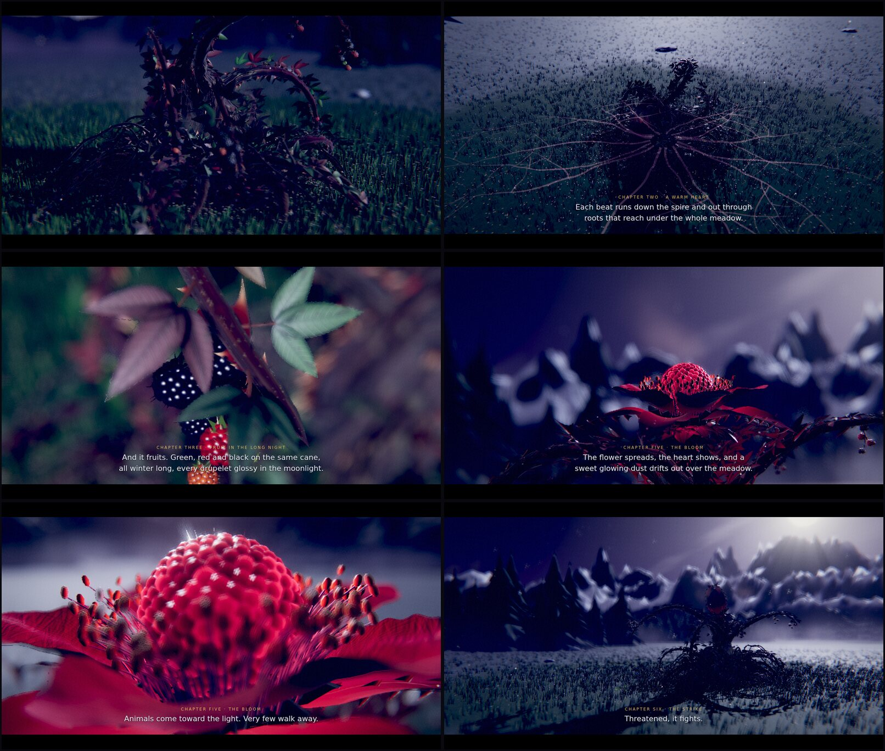
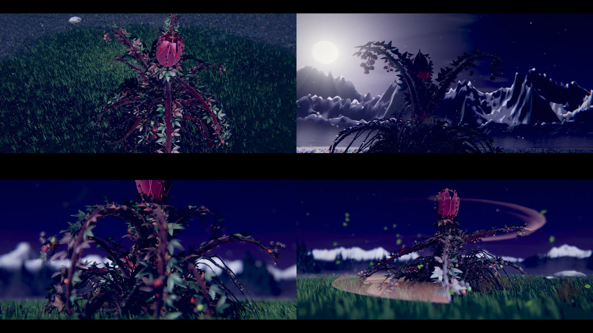

# The Bramble Colossus: a field study

The Bramble Colossus built again at laptop detail, thinking about what it is in the world, and shown as a short nature film with an **Explore** mode. Its body, rig, moves, hit times and anchors are the game's (`../../3d-model-new-character-ideas/bramble-colossus/colossus.js`, which is also `src/models/colossus.js`), so this model can stand in for it. Everything you see is new: its geometry, textures, materials, effects and the place it lives.

**The film:** https://claude.ai/artifact/NuZgcibtA6gy3RDYv4EH44 (private; made for a laptop, with sound). `Bramble_Colossus_Field_Study.html` in this folder is the same page as one file, to open in Chrome, Edge, Firefox or Safari.

**In motion, the short:** https://claude.ai/artifact/67kPPSanmHLhMKx77iMezn, and `Bramble_Colossus_In_Motion.html` here. A minute and a half with no words: the Colossus standing tall, as the battle shows it, creeping across the meadow and striking (below).

- **Watch the film:** about four minutes in eight chapters. Space pauses, the left and right arrows jump between chapters, and the strip along the bottom starts any chapter. The words are on screen; the narrator is off for now (Chris, October 4: hold off on a voice until a better one can be made).
- **Sound check** (on the start screen and in the bar along the bottom): every sound, to play, switch off and set how loud; the levels stay on that computer.
- **Explore it yourself:** drag to turn round it, scroll to come closer, right-drag (or Shift and drag) to slide, double-click for the front view. Every move is a button. Labels name its parts; click one to go to it. You can show its roots under the meadow, hold its bud open, put it in its Wrath, stand a person beside it for scale, **let it wander** (it turns, creeps somewhere new inside its ring, stops and tastes the air, and the camera follows), change the frost, wind and mist, slow time down, and set the depth of field. **Under the hood** shows the numbers and sets the detail (Medium, High, Max).



## What it is, in the world

What the film shows comes from the lore and the game, and where it needed more, from what a real blackberry is. New ideas are marked; none of them is canon until Chris says so (`../../docs/questions/open.md`, 29).

- **Where it lives:** the meadows below the frozen pass by Frostmere Lake, the last band of the game (levels 16 to 20), as `docs/design-decisions.md` places it. The meadow is built after the painting chosen for its fight, *05 Frostmere Lakeside Meadow*: the snow-capped ranges, the spruce forest, the lake, the big moon and no stars.
- **Its heart is warm** (the handoff's *Thornheart* idea, made visible). Each heartbeat runs down the spire into its roots, and the warmth goes with it. *New:* its roots run on under the meadow for about 20 m, and the frost stops where they end. Inside that ring the grass is green and the small white flowers of the painting are open, in the middle of winter; outside it the grass is silvered with frost. Its breath steams in the cold air, and frost furs only its outermost canes and leaves, never the ones near its heart.
- **It fruits all winter** (*new*): green, red and black berries on the same canes, as a lure on the longest nights.
- **It feels its prey through its roots** (*new*): warmth and footsteps, since it has no eyes and no face. In the film the camera is its prey for one chapter, stepping into its reach.
- **Thornwood** is what blackberries really do: a cane roots wherever its tip touches the ground. This one does it in a heartbeat. The tips of its six legs have rooted where they rest.
- **It grows from a thicket like the Bramble Horror**, over a century or more, as the Colossus's own README says it is the Horror grown into a boss.
- **Kept out on purpose:** moths. A pale moth is a soul going home, so the Bramble neither hunts nor eats them.

## What is new in the model

- **Canes** with five angles, as bramble canes have, wine-dark under a bluish waxy bloom with pale lenticels and healed splits, turning grey and fissured (old bark) toward the base of the great canes and all up the spire. The veins glow from the grooves between the angles.
- **Prickles** on the angles, broad and flattened where they grow along the cane and hooked back toward its base, wine-red at the root, red-brown, then straw at the hard point; some small, some large; great hooks toward the arms' tips.
- **Leaves** of three and five toothed leaflets on prickly stalks, built leaflet by leaflet, folded along the midrib and drooping, with the vein net in their relief. Most are dark winter-green, some turned wine-red by the cold, young bronze ones at the tips, dead ones low down and fallen ones round it. Their undersides are paler and felted. Moonlight, or the heart's light, shines through a leaf from behind, and only where it is not in shadow.
- **Fruit** of round glossy drupelets, 40 to 60 to a berry, each still carrying its dry style as a fine whisker, with a five-pointed calyx, at every stage of ripeness on the same bunch.
- **The heart**: about 320 drupelets lit from inside, each with a glowing style, brightest at its middle.
- **The flower**: crinkled crimson-rose petals with veins out of a dark throat, felted crimson sepals with prickles and a claw, about 170 stamens in three rings with gold anthers, a ring of fangs.
- **The mound**: about 50 twisted roots made of fibres, 11 great roots arching out of the soil, 80 rootlets, 30 old grey dead canes snarled through it (a real thicket is half dead wood), moss on the upper sides, and its own fallen leaves round it.
- **Shadows**: it casts and takes the moon's shadow, and its shadows match its cuts, its fades, its leaves' shapes and their sway.
- **Frost and breath**: rime on the upper faces of everything far from its heart, glinting as the camera moves; steam rising off the mound, more from the bud when it opens and while it feeds.
- **Its roots under the meadow** for the x-ray: 15 great roots branching twice, out to about 22 m, lines of light the heartbeat runs out along.
- **Smoother bending**: its canes have 10 segments instead of 8.
- It keeps every move of the game's model with the same lengths, hits and cues, and the same state fields.

## The film

| Chapter | What it shows |
|---|---|
| Frostmere | The lake, the forest and the ranges from the air, and the title |
| A hill of brambles | The meadow under the frozen pass, and a hill of brambles that is one plant, awake |
| A warm heart | The shut bud and its seam of light; the roots under the meadow lit by its heartbeat; the green ring in the frost, from above |
| Fruit in the long night | A bunch of berries close up; warmth, light and food on the longest nights |
| It wakes | The camera steps into its reach as its prey, and it wakes; every cane rises |
| The bloom | Siren Bloom from the side, then its heart close up |
| The strike | Thorn Lance in slow motion, its hooked prickles, and Hammerfall |
| Where the tips touch | Thornwood |
| The long night | It settles back into a hill of brambles; the field notes |

The words are a first draft for Chris's lore conversation: what the film says is in `film.js`, as plain data.

## In motion

Chris, October 4, after the film: a shorter, more dynamic version, the Colossus moving and doing a few of its moves, and the larger Colossus of the battle page (`Bramble_Colossus_Battle.html`) rather than the hill of brambles the film mostly shows. It is the same creature: the short shows it standing in its battle stance the whole way, at the battle's level 10 (darker, longer thorns, veins that glow at rest).

| Part | What happens |
|---|---|
| It wakes | Frost on a bunch of its fruit, one cane lifting to taste the air; the title over it, standing in the meadow; every cane rises |
| On the move | It creeps 12 m across the meadow on its six legs, the tips tearing their roots free and planting again: alongside it in the grass, head on as it comes, from high in front with the green ring moving with it, low by a leg as it stops and turns |
| The hunt | Siren Bloom close up; Thorn Lance in slow motion; Maelstrom; Hammerfall, slowed as it falls |
| The long night | It stands against the moon, the bud parted on its heart; wolves on the pass |

Its walk is the game's own creep (`animate(phase, walk)`, 4.2 of phase a metre, as the battle drives it); the page moves it along a route (`motion.js`), and its warm ring and the moon's shadow follow it. It walks toward the moon so its front is lit.



## Sound

All in `sounds.js`, made in code when the page starts its sound (the project has no recordings of nature), about 1.5 s to make on a laptop, through one reverb shaped like a snowy meadow ringed by forest. Each sound is placed left or right, near or far, by where it is in the picture.

- **The Bramble's own sounds are organic**, wood, leaves, soil, roots and air, nothing that roars (it has no throat): canes creaking as they bend, its leaves, a leg coming down through the frost, roots tearing free as a leg lifts, its heartbeat (only heard close to), steam breathed out of the bud, the whole thicket straining, a cane swung, a cane into the ground, Hammerfall, the flower opening, swallowing, Thornwood, the thorn volley, fire on it, and Felled. Each move plays its own (`SOUNDS` in `page.js`).
- **The night is quiet and sparse**: wind in the spruce that comes in gusts and dies away to nothing (it follows the Wind slider), and now and then an eagle owl, a tawny owl, the lake ice singing or booming, redwings passing over, a tree cracking in the frost, wolves far off. They fall silent while it hunts, and for a while after it does something loud.
- **What changed (Chris, October 4):** the steady hiss under the first version was the living battlefield's wind loop, from `sfx.js`; it is gone, and the field study no longer uses `sfx.js` at all.

## Numbers

| | This model | The game's model |
|---|---|---|
| Triangles | 999k at detail 1 (laptop), 157k at .5, 98k at .25 | 102k to 106k |
| Bones | 226 (208 below detail .6) | 201 |
| Draw calls | 8 body, 15 effects | 8 body, 13 effects |
| Textures | 9 for its body (painted in code: 1024 to 2048 pixels, each with a normal map from its own height painting) | 8 |
| File, as written | 170 KB | 139 KB |
| File, shrunk and compressed | 37 KB | 31 KB |
| Build time | about 1.5 to 3 s on a laptop (2.7 s in the slow test browser) | about 0.3 s |

The whole scene at High: about 3.8 million triangles a frame counting the moon's shadow and the lake's reflection (the bramble 1 M, and again for its shadow; the grass 0.8 M; the forest 0.7 M, part of it again in the lake; the ranges 0.15 M), 55 draw calls, then the film camera's passes. Medium draws about a third of that and at a lower resolution, for laptops without a separate graphics card; Max adds grass and trees and a sharper picture.

Each page is about 0.33 MB as one file. three.js r128 comes from cdnjs, as for every page in the project.

## Integration card

```text
Model: Bramble Colossus (field study)   File: 3d-model-field-studies/bramble-colossus/colossus.js   Function: makeBrambleColossus(opts)
Height: 7.5 m (8.3 m at level 20); 11 m across at rest, its arms reach 9 m
Triangles: 999k (detail 1), 157k (.5), 98k (.25)   Bones: 226 (208 below detail .6)   Draw calls: 8 + up to 15 for effects
Anchors: the game's (chest, head or bud, hit, heart, bloom, crown, grasp, held, snare or impact, feet, cane0 to cane9), and hitmid
  (halfway out along the lead arm), fruit (a front leg's bunch), bunch0 to bunch17
State fields: the game's (target, wilt, glow, wrath, open), and xray (0 to 1: its roots under the meadow), frost (0 to 1: how cold
  the night is), breath (how much it steams), wind ({ x, z }: where its steam drifts)
Actions: the game's, unchanged (appear, alert, bloom, lance, slam, whirl, volley, devour, briar, enrage, hurt, burn, block, rest, die)
Notes: taste() makes one cane lift and taste the air; beats counts its heartbeats (for sound). opts: detail .25 to 1, level, size,
  shadows (true: casts and takes shadows with matching depth materials), linear (default true: colours for a tone-mapped renderer;
  false for the game's plain one), frost. Its fx group holds two point lights, as the game's model does.
```

To use it in the game, build it at detail .25 with `linear: false` and `shadows: false`; the game's renderer has no tone mapping or shadows.

## Files

| Path | What it is |
|---|---|
| `colossus.js` | The model, joined from `model/` |
| `model/` | The model's source in twelve parts; `node model/join.mjs` writes `colossus.js` |
| `frostmere.js` | The meadow by Frostmere: sky and moon, the ranges, forest, lake with its reflections, ground, grass and flowers that answer the frost and the warm ring, stones, mist, ice in the air, and the height fog |
| `cinema.js` | The film camera |
| `film.js` | The film's chapters, shots, moves and words |
| `motion.js` | The short, In motion: its route and shots |
| `sounds.js` | Every sound, made in code: the Bramble's and the night's |
| `field-study.html`, `in-motion.html`, `page.js`, `field-study.css` | The two pages' source (they share `page.js` and the stylesheet) |
| `Bramble_Colossus_Field_Study.html`, `Bramble_Colossus_In_Motion.html` | The built pages |
| `renders/` | Stills from the film and the short |

## Still open

- **The new ideas** above (the warm ring, roots under the meadow, winter fruit, sensing through its roots, the Horror as its young): `../../docs/questions/open.md`, 29.
- **The words** of the film are a draft for the lore conversation.
- **A narrator**, if a better voice can be made; until then the words are on screen only.
- **Next, if Chris wants:** the Bramble Horror and the Bramble Ancient at the same detail, as the rest of the family; the young thicket beside it in the film; birds roosting in its mane; a dawn.
