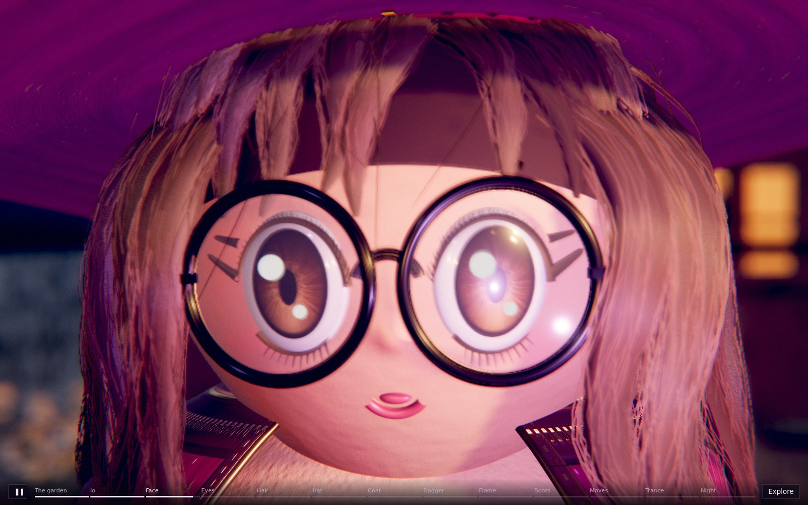
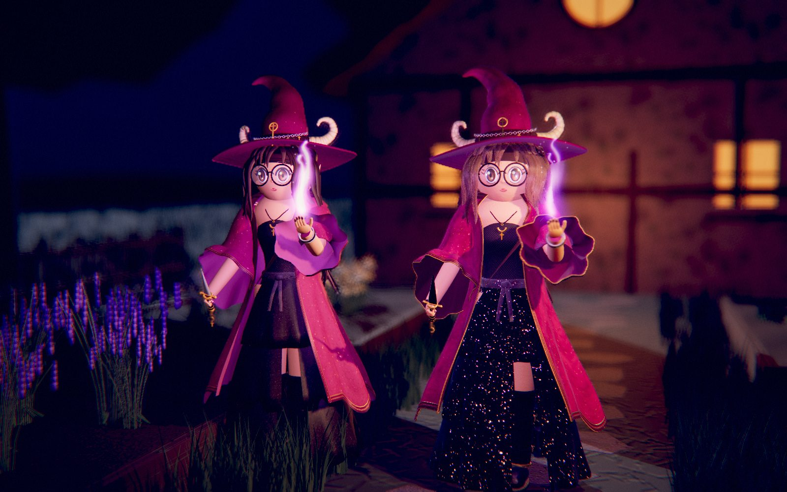
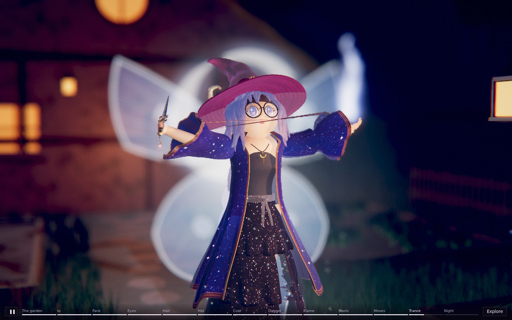

# Io, the Witch: a main-character study

Io built again at the level of detail of the Bramble Colossus field study, and shown in her cottage garden in Wickhollow at night, with a guided tour and an **Explore** mode.

**The page:** https://claude.ai/artifact/NiYpeFMYbEtmib2bcMgQEK (private). `Io_Main_Character_Study.html` in this folder is the same page as one file, to open in Chrome, Edge, Firefox or Safari. It is made for a laptop; on a phone it starts at the lighter Medium detail.

- **Take the tour:** about a minute and a half, thirteen shots, each a close look at one part of her with a few words: the garden, Io, her face, eyes, hair, hat, coat, dagger, flame, dress and boots, her moves, Lunar Trance, and the night. Space pauses, the arrow keys step between shots, and the strip along the bottom jumps to any of them.
- **Explore her yourself:** drag to turn round her (one finger on a phone), scroll or pinch to come closer, right-drag or two fingers to slide, double-click for the front view. Every move is a button. Labels name her parts; click one to go to it. Close-ups of her face, eyes, hat, hair, dagger, flame, coat and boots. She can **walk the path** (to the gate and back), raise her **guard**, go into **Lunar Trance**, and stand **beside the game's Io** for comparison. The light can be her lantern, the moon only, or a plain grey **studio**. Time can run at half or a fifth of its speed, and **Under the hood** shows the numbers and sets the detail (Medium, High, Max).



## What stays the game's

The project's rule is that the Witch's 3D model keeps exactly how she looks and moves. This study keeps to it, and it is a test in its own folder: the game still uses `src/models/witch.js`.

- **Her shape:** the same 51 bones in the same places, the same skin weights, and every part at the size and place the game model gives it: head, glasses, hat, horns, coat, sleeves, dress tiers, sash, boots, hands, dagger, necklace, bracelets.
- **Her colours:** every colour is the game model's own (her magenta coat with gold and pink stars, black tulle dress, grey sash, dark brown hair in its two shades, amber eyes, cream horns, gold and silver).
- **Her hair:** every lock (12 bangs, 13 over the crown, 10 at the sides, 28 in the ponytail) is where it was, with the same wave and shade, because the model replays the game model's own random numbers to place them.
- **Her movement:** the motion code is the game model's, line for line: every action's keys, durations, blends, hit and cue times, her walk and idle, her blinking and looking about, and the springs on her skirt, coat, hair, hat tip and dagger charm. Only the lines that draw her flame, her glow and the dagger's trail were changed.
- **Her interface:** `makeIo(opts)` has the game model's interface (`animate`, `play`, `guard`, `reset`, `trance`, `ACTIONS`, `anchor`, `state`, `setFade` and the rest), so the battle could use it in place of `makeWitch`.



## What is new, part by part

- **Face:** one smooth sculpt with her small nose and fuller cheeks in it, where the game model sets a nose on the face. Her blush is painted into the skin, soft at its edges, with a warmer nose tip and pores in its relief. The skin is lit as skin is: light wraps a little past the edge of the lit side and comes out warm and red there.
- **Eyes:** the amber iris painted at four times the size, with fibres, a collarette and a dark rim; a clear, wet cornea over each eye that catches the lanterns and the moon; the game model's two highlights; lids that blink as before; an upper lash line with single lashes and the two long flicks at the outer corner; lower lashes of single hairs.
- **Brows:** the game model's arcs, as soft bands with single hairs combed along them.
- **Hair:** each lock is a dark core filled out with fine strands (3,148 of them at full detail), darker at the roots and inside the lock, each a slightly different shade, a few stray hairs lifting off the crown and the ponytail. Two highlights run along each strand, as hair shines.
- **Hat:** velvet with embroidered stars, over a brim that now has a thickness and a wired edge; the crown flops as before; the band is real fuzz; the ram horns have twelve ridges and fine growth lines, polished; the silver chain, its gold crosses and the big charm are bevelled metal that reflects the night.
- **Glasses:** fine black frames with hinges; the lenses are domed glass that reflects the lanterns and the sky and never darkens her eyes.
- **Coat and sleeves:** velvet with a pile that shines at the edges, the stars worked in gold thread (which shines as metal) and pink silk; a satin lining inside with a thickness between; the trim is a woven ribbon with a twisted gold cord and satin-stitched gold blocks; gold piping runs round every edge and cuff. The hood lies in soft folds. The coat's outline is now a smooth curve through the game model's points.
- **Dress:** black tulle net with sequins, and a share of tiny facets that catch a lantern or the moon only when it, the facet and the eye line up, so it twinkles as she moves.
- **Bodice, sash, necklace:** the bodice's diamond net is knotted where its threads cross; the sash is grey satin with a gathered knot; the necklace is a twisted two-strand cord with a bevelled gold crescent and cross.
- **Boots:** creased, pebbled leather with a rolled top, straps with stitched edges and gold buckles (frame and prong), a sole with an edge, a block heel, the crescent anklet.
- **Hands:** each finger one smooth shape through its joints, with lacquered nails.
- **Dagger:** a blade with edges, bevels and a fuller groove, engraved with a crescent, a line of stars and a vine; a wrapped leather grip with gold rings; a fluted pommel; a ringed guard.
- **Her flame:** drawn as it burns. The game model's flame is eight painted frames of a wisp whose spine sways and curls at the tip; this one draws that same spine and its three glowing layers continuously, at the flipbook's pace, with noise licking its edges. It turns moon-white for her moon spells, as before.
- **Her spells' light:** the moon sigil, beam, pool and motes, the dagger's trail (a smooth curve through its last sixteen positions) and the trance's moth wings, starlight and crescent are drawn at higher resolution; the sigil gains the moon's phases and fine ticks, the wings finer veins and scales.
- **Shadows:** she casts and takes the moon's and her lantern's shadows.



## Where she is shown

Her cottage garden in Wickhollow, at night, after the walking map painted for it (`reference/art/walk/walk-wickhollow-cottage.png`; the design decisions mention Io's cottage). A stone cottage with a mossy roof, a round lit window and the door ajar; a flagstone path between four raised beds of lavender, white flowers, blue spires and herbs; a picket fence, a gate between two stone pillars with lanterns; a lantern on a post by the path, which is her key light; a cauldron; dark trees with hanging moss; smoke from the chimney; a big moon and **no stars** (the sky has none until the ending). It is all in `garden.js`. Nothing in it is new lore.

## Numbers

| | This study | The game's model |
|---|---|---|
| Triangles | 1,089,000 at detail 1 (laptop), 294,000 at .5, 119,000 at .25 | 99,000 |
| Bones | 51 | 51 |
| Meshes | 44 (her body is one per material, as in the game's model) | 41 |
| Hair | 98 locks, 3,148 fine strands (1,574 at .5) | 98 locks |
| Textures | about 40, painted in code at 512 to 1024 pixels (half below detail .6), most with a normal map from their own height painting | 31 |
| File, as written | 152 KB | 103 KB |
| File, compressed | 48 KB | |
| Build time | about 2.4 s at detail 1 and 0.8 s at .5 in the slow test browser | about 0.2 s |

The page is one file of about 350 KB; three.js r128 comes from cdnjs, as for every page in the project.

## Integration card

```text
Model: Io, the Witch (main-character study)   File: 3d-model-main-characters/io/io.js   Function: makeIo(opts)
Height: about 1.9 m to the hat's tip, as the game's model
Triangles: 1,089k (detail 1), 294k (.5), 119k (.25)   Bones: 51 (the game's)   Meshes: 44
Anchors: the game's (chest, head, hit or tip, flame, handL, handR) and hatTip, horn, charm, glasses, eye, ponytail,
  scrunchie, coat, dress, sash, boot, necklace, bracelet, dagger
State fields: trance (0 to 1), as the game's
Actions: the game's, unchanged: cast, lunge, combo, throw, crescent, mend, hurt, block, kneel, victory, moon, summon,
  briar, transform, rise; with the same durations, hits and cues
Notes: opts: detail .25 to 1, shadows (true: she casts and takes shadows), linear (default true: colours for a linear,
  tone-mapped renderer with an environment; false for the game's plain one). strands tells how many fine strands her
  hair has. Her fx group holds her moon spells' point light, as the game's does; her flame's light is on her hand.
```

To try it in the game, build it at detail .25 with `linear: false`; the game's renderer has no tone mapping, shadows or environment to reflect, so the metal is made less metallic there.

## Files

| Path | What it is |
|---|---|
| `io.js` | The model, joined from `model/` |
| `model/` | The model's source in fourteen parts; `node model/join.mjs` writes `io.js` |
| `garden.js` | Her cottage garden at night, its lights, and the plain night her metal and glass reflect |
| `cinema.js` | The film camera, copied from `3d-model-field-studies/bramble-colossus/cinema.js` |
| `study.html`, `study.css`, `page.js` | The page's source: the tour, Explore, labels and close-ups |
| `Io_Main_Character_Study.html` | The built page |
| `tools/build.mjs` | Builds the page: `node tools/build.mjs` (from this folder) |
| `tools/look.mjs`, `tools/look.html` | Headless pictures of the model alone, in the battle's light, a night light or a studio, with any move at any moment |
| `tools/shots.mjs` | Headless pictures of the built page, driven through its test hooks |
| `renders/` | Stills from the page |

The tools use Playwright and three.js r128 from npm (cached in `../.cache/`, which git ignores).

## Still open

- **A look from Chris** at her face and hair in particular, since those changed the most in how they are made.
- **The garden** is a backdrop at a lower level of detail than she is; it could be brought up (the beds, the cottage) if she is to be filmed in it.
- **Sound:** none yet. The Bramble's study has its own sounds; Io's could have her flame, her coat and the night in Wickhollow.
- **Next, if Chris wants:** the other main characters in this folder, each kept to her game model in the same way.
