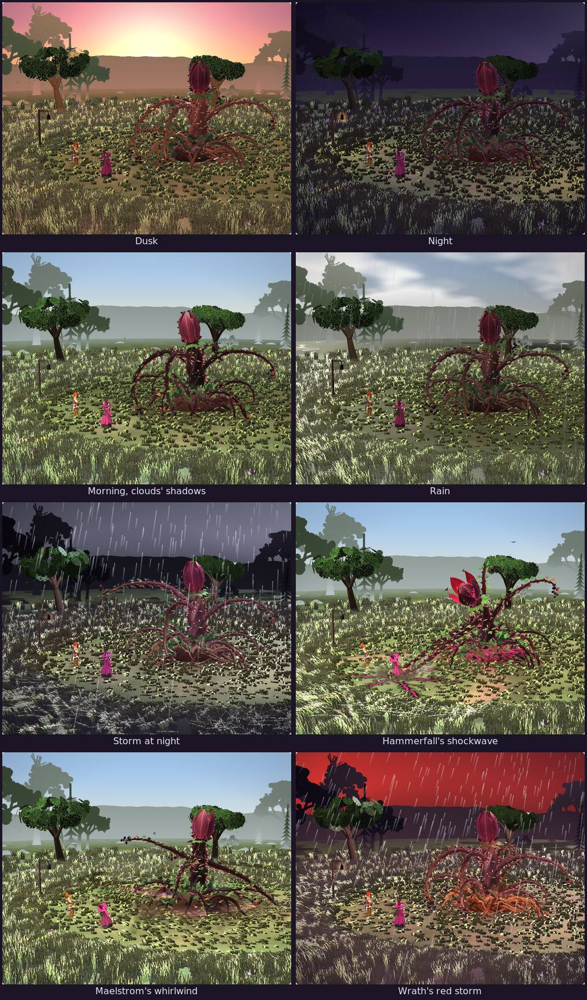

# 3D Model: New Character Ideas

Creatures and characters Chris brings to the project as ideas, each with its code-built 3D model and a bench page to judge it on, polished in this folder. None of them is part of the game's story until Chris places it (`docs/questions/open.md` asks where each one might fit). Each model follows the same Model Build Spec as the cast (`docs/specs/model-build-spec.md`), so any of them can join a battle later without changes.

| Idea | Folder | Page | State |
|---|---|---|---|
| Bramble Horror | `bramble-horror/` | https://claude.ai/artifact/ASy7Y7hL3EuAHZbFDwihWv | Version 2, October 3, 2026 |
| Bramble Colossus, the Bramble Horror grown into a boss | `bramble-colossus/` | https://claude.ai/artifact/HbXsmA8xNLUnLMQ6px7h6Q | Version 1, October 3, 2026 |
| Emberback, a giant salamander of the buried sunstone | `emberback/` | — | Chris's sheets in, October 3, 2026; the model is next |
| Gloamwing, a great night-flier that hunts the souls' moths | `gloamwing/` | — | Chris's sheets in, October 3, 2026; the model is next |

The Bramble Colossus has no `original/`: it was made here from the Bramble Horror, as Chris asked, and its bench shares the Bramble Horror's `bench.css` and its two places, `glade.js` and `meadow.js`.

## Places for the benches

Painted in code and shared by any wilderness bench, in `bramble-horror/`. Neither is a place in the game's world: they are stages to judge a creature on. **Place**, in a bench's Light and place, switches between them and a bare floor.

| Place | File | What it is |
|---|---|---|
| Wild glade | `bramble-horror/glade.js` | A moonlit clearing deep in a misty forest, under the battle screen's Night square light or an overcast day. The Bramble Horror's bench opens in it. |
| Wild meadow | `bramble-horror/meadow.js` | Added October 3, 2026: a meadow at the forest's edge that is never still, and that answers the creature in it. The Bramble Colossus's bench opens in it, at sunset. |

What the wild meadow does:

- **Its hours turn.** The sun goes down through an opening in the forest, the stars come out, fireflies rise from the grass, the two lanterns light up and bats circle them; then dawn comes, and a sunny day with clouds whose shadows drift over the grass. A whole day takes about six minutes. **Time** picks any hour and **Time runs** stops or starts the clock. **Night square** jumps to ten at night, when its light is the battle screen's own (the lanterns stand in for the battle's two lamps), and **Daylight** jumps to noon.
- **Weather.** **Clear**, **Rain** (rain, a stronger wind, puddles that ripple) or **Storm** (lightning over the forest, thunder that shakes the camera a moment later, a gale through the grass). Bad weather rolls in and clears over several seconds.
- **The wind** never stops: gusts roll across the tall grass in waves, the trees sway, the lanterns swing, and leaves blow across the meadow.
- **It answers the creature.** Its blows send a shockwave rolling out through the grass and the mist, throwing up turf and dust; heavy blows shake the trees and put the birds up out of them, and so does a roar. The Colossus's Maelstrom raises a whirlwind that tears up grass and dust, and its Wrath turns the sky into a red storm with red lightning, embers rising off the meadow.



Its numbers: 65 KB as written (16 KB shrunk and compressed), 96k to 101k triangles (most of them grass), 27 to 30 draw calls, 12 textures (25 MB), about 300 ms to build on a desktop, and under 0.1 ms a frame to run.

## What goes in an idea's folder

| Path | What it is |
|---|---|
| `README.md` | What the idea is, what changed, its numbers, and what is still open |
| `<id>.js` | The model: one function `make<Name>(opts)`, three.js r128, no imports |
| `<id>-*.html`, `bench.js`, `bench.css` | The bench page's source, built into one file by `tools/build.mjs` |
| `*_Bench.html` | The built page, one self-contained file to open or pass on |
| `original/` | The idea exactly as Chris brought it, never edited; its model drives the bench's Before switch (for ideas he brought as files) |
| `renders/` | Before-and-after records |

To rebuild a page after changing its files, from the repository's top folder:

```sh
node tools/build.mjs 3d-model-new-character-ideas/bramble-horror/bramble-horror.html
cp dist/bramble-horror.html 3d-model-new-character-ideas/bramble-horror/Bramble_Horror_Bench.html
```

The same for `bramble-colossus/bramble-colossus.html`. `dist/<name>.artifact.html` is each page without its outer document tags, for publishing.
