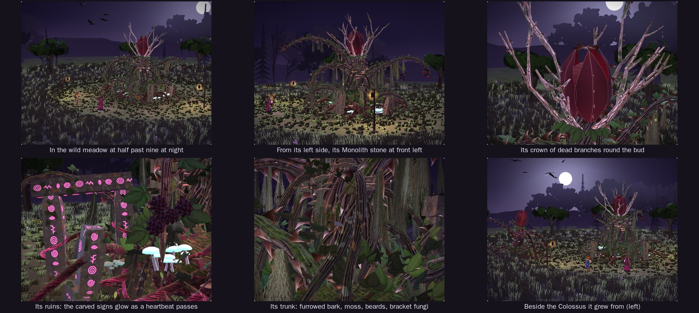
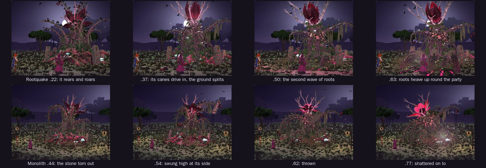

# Bramble Ancient

A test: how far the Bramble Colossus can be taken with everything learned building it, the Emberback and the Gloamwing. The Ancient is the first bramble, as old as the forest: the Colossus as it would be after centuries, a little bigger and far more worked. "Bramble Ancient" is a working name (Bramble Elder, Primordial Bramble or Bramble Titan would do as well). Nothing here is canon until Chris places it (`docs/questions/open.md`, question 7).

**The page:** https://claude.ai/artifact/Lt1LuBqNE2zKKCuYFtAg3B (private; it works on a phone). `Bramble_Ancient_Bench.html` in this folder is the same page as one file. It opens at half past nine at night in the wild meadow, with the Ancient rising out of the earth among its standing stones.



## What it is

- **Bigger.** About 10 m to the top of its flower (the Colossus is 7.5 m), with its arms and its crown of dead branches rising to about 12 m, and 16 m across at rest. **Colossus beside it**, in the bench's Light and place, stands the boss it grew from next to it.
- **Its trunk** is five old canes braided together like the trunk of an old fig tree, swelling where they knot and splaying out into the mound. Their bark is deep and furrowed, cracked, with crusts of pale lichen.
- **Moss** grows on every upper side, on its trunk, canes and roots and on the stones, and long beards of grey-green moss hang from its canes and trunk, swaying as it moves.
- **Roots everywhere:** hanging roots drop from the trunk into the mound, roots coil round each standing stone, and ivy climbs its trunk.
- **Its crown:** seven pale, bleached dead branches like antlers stand round the flower. The flower is doubled: five more petals open inside the first five.
- **The ruins it grew through:** an old stone arch leaning out of the soil behind it to its right, with a fallen block at its foot, and five standing stones round it, all carved with signs. The signs glow with each heartbeat as the beat runs out through its roots, and burn red in its Wrath. When it withers away, the stones stay.
- **What is left of those who fought it:** two swords grown into its trunk, a spear through its mane, another in its mound, five arrows in its lead arm, and a split round shield half sunk in its roots.
- **Fungi:** shelves of bracket fungus up its trunk and on its mound, and clusters of small mushrooms whose caps glow a pale sea-green and light the ground round them. Spores drift up off them.
- **Life round it:** fireflies drift and blink round it, and nine birds sit on its arms and crown. Its roars put them up; they circle high and come back down when it is calm.
- It keeps everything of the Colossus's: the bud that opens on its heart, the heartbeat that runs down the spire into its roots, the hooked thorns, fruit on swinging bunches, canes on springs that whip and lag, a fear of fire, canes it can lose and grow back, wilting as it weakens, and its Wrath.

## Its moves

All of the Colossus's, with the same lengths, hits and cues (`../bramble-colossus/README.md` says what each does), and two of its own:

| Move | Length | Hits | Cues | What happens |
|---|---|---|---|---|
| Rootquake (`quake`) | 3.6 s | .58 | .22, .34, .40, .48 | It rears and roars (.22), then drives every cane into the earth (.34). The ground splits from its feet out to the party, and its great roots, mossed and dripping rootlets, heave up out of the soil in three waves (.40, .48), the last under the party's feet: one blow on everyone (.58). Then they sink back. |
| Monolith (`hurl`) | 3.8 s | .76 | .26, .33, .58, .88 | Its left arm reaches round to the standing stone at its left and coils round it (.26), tears it out of the earth in a burst of soil (.33), swings it high and back at its side, and hurls it at its prey (.58). The stone shatters on her (.76) into rubble and glowing shards of its signs. Then its roots draw the stone back up out of the ground where it stood (.88). |



## The bench

As the Colossus's bench, with these changes:

- **The party** stand a little further out, for its longer reach. Rootquake strikes both of them; the Monolith goes for its **Prey**.
- **Sound** (in the header): every sound is made in code by the living battlefield's `sfx.js`, nothing recorded. Its creaks, growls and roars, the crack of the ground splitting and the rattle of falling stones, the roots bursting up, the stone tearing out, the swing and the smash, its faint heartbeat while it waits, its birds, the party's blades and fire, and the meadow's wind, rain and night insects. Browsers start sound only after a tap; the sounds take a few seconds to make the first time.
- **Sever a great cane** takes its mane first, then its arms. While its lead arm is severed, Watch a fight leaves out Thorn Lance; while its left arm is, the Monolith.
- **Colossus beside it** in Light and place, to see how much bigger it is.
- In the meadow its own moves answer too: Rootquake's waves ripple out through the grass and its roar puts the birds up; the stone tearing out, landing and rising again each send a wave through the grass.

The damage numbers are placeholders until the battle steps: level 1 is the Night square's scale (its HP 8,000, Rootquake 300 to each, the Monolith 440), and everything grows 20% a level with a swing of up to 25% either way.

## Numbers

It is a test, so it goes past the Model Build Spec's ceilings for a boss (120k triangles, 140 KB of code) on purpose.

| | Bramble Ancient | Bramble Colossus, for comparison |
|---|---|---|
| File, as written | 193 KB | 139 KB |
| File, shrunk and compressed | 42 KB | 31 KB |
| Triangles | 151k (level 1) to 156k (level 20); 59k at half detail | 102k to 106k; 40k at half detail |
| Draw calls | 13 body, 15 effects | 8 body, 13 effects |
| Bones | 226 (209 at half detail) | 201 |
| Textures | 14 for its body, 19 with its effects' (about 17.5 MB) | 8 (13 MB) |
| Build time, in a headless browser on this machine | about 0.4 s (0.26 s at half detail) | about 0.35 s |
| Animation, per frame | about 0.4 ms | 0.3 to 0.45 ms |

## Integration card

```text
Model: Bramble Ancient (a working name)   File: 3d-model-new-character-ideas/bramble-ancient/ancient.js   Function: makeBrambleAncient(opts)
Height: 9.9 m to the top of its flower (10.9 m at level 20); its arms and its crown rise to about 12 m; 16 m across at
  rest, and its arms reach 10 m
Triangles: 151k to 156k (59k at detail .5)   Bones: 226   Draw calls: 13 + up to 15 for effects   Textures: 14 for its body
  (about 17.5 MB with its effects')
Anchors: the Colossus's (chest, head or bud, hit, heart, bloom, crown, grasp, held, snare or impact, feet, cane0 to cane9),
  and stone (the Monolith's stone, standing, held or in flight) and quake (= impact: where the last roots heave)
State fields: the Colossus's: target ({x, y, z}: the prey's chest), wilt (0 to 1), glow (0 to 1), wrath (0 to 1)
Actions: the Colossus's, unchanged (appear, alert, bloom, lance, slam, whirl, volley, devour, briar, enrage, hurt, burn,
  block, rest, die), and quake 3.6 s hit .58 (everyone) cues .22 .34 .4 .48 | hurl 3.8 s hit .76 cues .26 .33 .58 .88
Walk: the creep, its legs walking; it is rooted, so dash is always 0
Notes: as the Colossus's: holding, inside and open; sever(k) and regrow(). Also: cut(k) says whether cane k is severed
  (hurl needs cane 1, its left arm; lance cane 0, the lead arm); stone is 0 standing, 1 in its grip, 2 in flight,
  3 shattered; beats and startles count its heartbeats and the times its birds are put up, for sounds. Its ruins stay
  when it withers away in die; setFade hides them with it. Three point lights in fx (its heart's glow, its burning, its
  mushrooms' glow). opts: level 1 to 20, detail .5 to 1, size.
```

## Files

| Path | What it is |
|---|---|
| `ancient.js` | The model. It began as a copy of `../bramble-colossus/colossus.js` and needs nothing else |
| `bramble-ancient.html`, `bench.js`, `ancient.css` | The bench page's source. It also loads Io's and Sol's original models (`src/models/originals/`), the Colossus (`../bramble-colossus/colossus.js`, for Colossus beside it, and its `boss.css`), its two places (`../bramble-horror/glade.js` and `meadow.js`, and the Bramble Horror's `bench.css`) and the sounds (`../../living-battlefields/sfx.js`) |
| `Bramble_Ancient_Bench.html` | The built page, one file |
| `renders/` | The sheet and the moves above, rendered headless from the bench |

To rebuild the page after changing its files, from the repository's top folder:

```sh
node tools/build.mjs 3d-model-new-character-ideas/bramble-ancient/bramble-ancient.html
cp dist/bramble-ancient.html 3d-model-new-character-ideas/bramble-ancient/Bramble_Ancient_Bench.html
```

## Still open

- **Whether it is more than a test.** Is there a place in the game for something this old and big, and what is it called? `docs/questions/open.md` asks.
- **Its ruins and the old weapons in it** are only scenery so far: the signs carved on the stones are made-up shapes with no meaning. If they stay, the lore decides what the stones were and who fought it.
- **Its cost.** It is about half again as heavy as the Colossus. If it becomes a boss, detail .5 (59k triangles) is the setting for phones, or it gets a lighter pass.
- **Art,** if it stays: a model sheet would let the next pass check it against a drawing.
