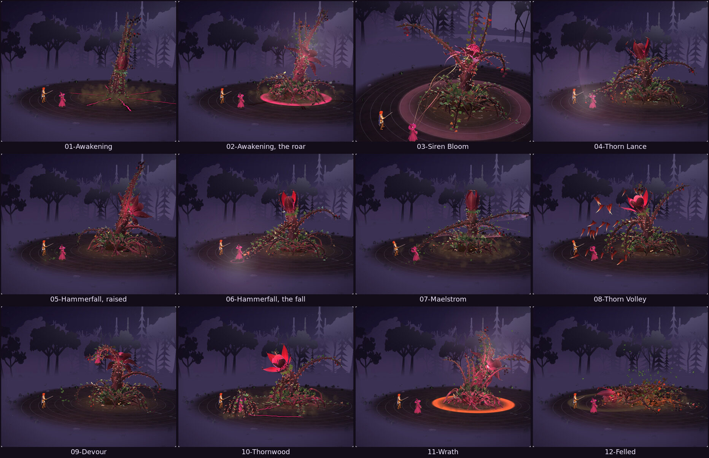
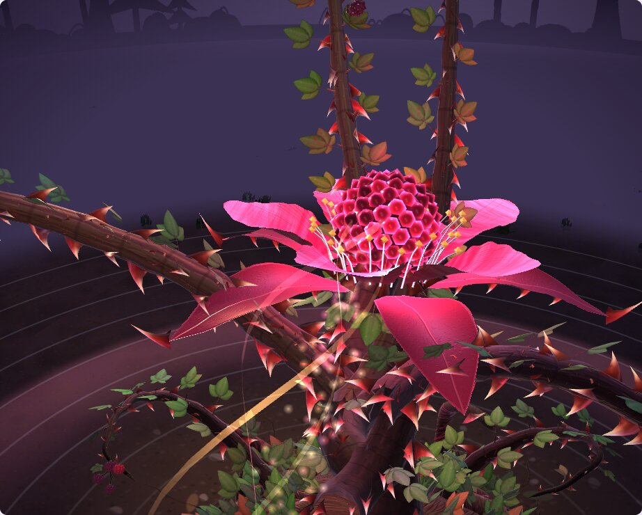
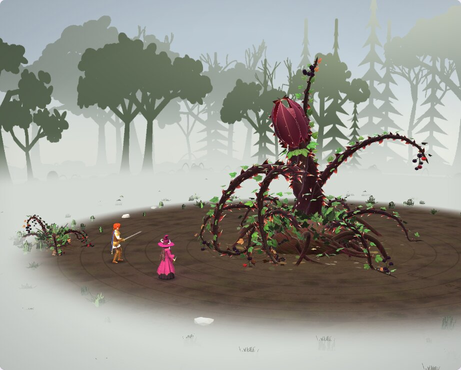

# Bramble Colossus

The Bramble Horror grown into a boss: the same hunting blackberry thicket, as big as a house. A mound of twisted roots, a spire of three old canes braided round each other rising out of it, and on top a thorned bud taller than a person that opens into a five-petalled blackberry flower round its heart, a glowing blackberry the size of a barrel. Four great canes grow from the spire: the two in front are its arms, the two behind arch back like a mane. Six more arch out over the soil as its legs. It still has no face: the bud turns toward its prey, gapes and feeds, and each heartbeat runs down the spire into its roots.

"Bramble Colossus" is a working name. Nothing here is canon until Chris places it (`docs/questions/open.md`, question 3).

**The page:** https://claude.ai/artifact/HbXsmA8xNLUnLMQ6px7h6Q (private; it works on a phone). `Bramble_Colossus_Bench.html` in this folder is the same page as one file. It opens at sunset in the wild meadow, with the colossus rising out of the earth.



## What it is

- **Gigantic.** About 7.5 m tall and 11 m across at rest, five times Io's height. Its arms reach 9 m. **Bramble Horror beside it**, in the bench's Light and place, stands the creature it grew from next to it.
- **The bud** is its head. Shut, it is a sculpted thorny bud with a glowing seam where the heart shows through. Open, five crimson sepals spread under five rose petals, a ring of fangs curls over the heart, and gold-tipped stamens stand round it. The heart is a giant blackberry whose drupelets glow from inside, beating twice every 1.7 seconds.
- **Its veins** run through the bark of its spire and canes as well as its roots. Each heartbeat runs from the heart down the spire, into the mound and out along the roots and canes.
- **Its Wrath**, its second phase at half its HP: the veins burn ember-red, the leaves redden, embers rise off it, its heart beats faster and its canes move more restlessly.
- It keeps everything of the Bramble Horror's: hooked thorns, fruit on swinging bunches, canes on springs that whip and lag, a fear of fire, canes it can lose and grow back, wilting as it weakens.



## Its moves

None of these come from a sheet: they were made for it, to be a boss's.

| Move | Length | Hits | Cues | What happens |
|---|---|---|---|---|
| Awakening (`appear`) | 4.6 s | | .04, .62 | The ground shakes and splits; it heaves up out of the earth spikes first, its legs slam down round it, it rears and its bud bursts open in a roar of light. |
| Alert | 1.8 s | | .22 | The spire turns and leans at its prey; every cane rises toward it. |
| Siren Bloom (`bloom`) | 3.4 s | .55 | .30 | The flower opens wide, its arms spread in welcome and glowing pollen pours over the party, who take a step toward it. The hit is a charm, not damage. |
| Thorn Lance (`lance`) | 1.8 s | .44 | .30 | The lead arm draws back high and spears down through its prey into the ground. |
| Hammerfall (`slam`) | 3.0 s | .50, .60 | .36 | Both arms rise 11 m and twine into one club, hang while the heart blazes, then fall on its prey. The ground splits and a shockwave runs out over the whole party (the second hit). |
| Maelstrom (`whirl`) | 3.6 s | .36, .48, .60, .72 | .20 | It winds round, then every cane whirls round it twice at three heights: four blows on the whole party. |
| Thorn Volley (`volley`) | 3.2 s | .58, .68, .78 | .38, .50 | Two whip-cracks fling its thorns in high arcs; they rain on the whole party in three waves, stick in the ground and crumble. |
| Devour | 5.2 s | .20, .58, .68, .78 | .62, .72, .82, .90 | Its arms seize its prey and lift it into the flower, which shuts. Three gulps, each a blow and then a heal, while ribbons of stolen life spiral down the spire. Then it bursts open and the arms set its prey back where it stood. |
| Thornwood (`briar`) | 3.8 s | .46, .66 | .30, .86 | Its canes stab the soil; the ground splits toward its prey and shoots as tall as young trees burst up round it, close over it and squeeze. |
| Wrath (`enrage`) | 3.2 s | | .42 | It curls in on itself, then bursts open in a ring of red light. The bench turns its look to the second phase at the cue. |
| Hurt | 0.8 s | | | Interrupt. |
| Scorch (`burn`) | 1.8 s | | | Interrupt. Its recoil from fire: leaves catch and curl black. |
| Block | 0.6 s | | | Interrupt. Arms crossed, bud shut tight. |
| Rest | 2.0 s | | | Holds. Bowed over its mound: from far off, a hill of brambles. |
| Felled (`die`) | 5.6 s | | .20, .50, .70 | Holds. A last flail, then the spire cracks at its foot and topples like a tree (.50 is the crash), the heart beats once more and goes dark (.70), and it crumbles away. |

## The bench

- **The party:** Io the Witch and Sol, from their original models, stand before it. **Prey** picks which of them its single blows and Devour go for; Hammerfall's shockwave, Maelstrom, Thorn Volley and Siren Bloom strike both. **Party** can also show Io alone, the plain 1.8 m figure, or nobody.
- **Fight it:** Io's dagger (three cuts) and flame, Sol's Flare Cut and Ember Rush (four burning blows at a run), and **Sever a great cane** (Sol's Sunder). Fire makes it recoil in Scorch. While its flower is open, blows land on its heart for double, marked **Weak point!**
- **Watch a fight:** the colossus and the party take turns by themselves. It turns to its Wrath at half HP and fights harder, falls after about a minute and a half, and wakes again.
- **The boss bar** across the top shows its HP with a mark at half, where the Wrath begins, and which phase it is in. **Wrath** in Fight it switches the second phase's look on and off.
- The battle's feel as on the Bramble Horror's bench: big numbers, rings, hit-stop, a camera that shakes harder the heavier the blow, and flashes. The ground rumbles while it rises.
- **Place:** the wild meadow (`../bramble-horror/meadow.js`; `../README.md` says everything it does), the wild glade with a wider clearing, or a bare floor, all with metre rings out to 12 m. In the meadow its hours and weather turn, and the meadow answers the colossus: Thorn Lance, Hammerfall, Thorn Volley, Devour's grab and Thornwood send shockwaves out through the grass from where they land; the Awakening shakes the ground as it rises and its roar puts the birds up, as Alert and Wrath do; Maelstrom raises a whirlwind; Wrath turns the sky into a red storm, which clears when it is calm again; and when it is Felled, its spire crashes down in a great wave. In the glade the light is the Night square's or an overcast day.

The damage numbers are placeholders until the battle steps: level 1 is the Night square's scale (its HP 6,400, Hammerfall 320 then 150, Thornwood 220 and 300), and everything grows 20% a level with a swing of up to 25% either way.



## Numbers

| | Bramble Colossus | Bramble Horror, for comparison |
|---|---|---|
| File, as written | 139 KB | 120 KB |
| File, shrunk and compressed | 31 KB | 27 KB |
| Triangles | 102k (level 1) to 106k (level 20); 40k at half detail | 74k to 109k |
| Draw calls | 8 body, 13 effects | 6 body, 10 effects |
| Bones | 201 | 120 to 152 |
| Textures | 8 (13 MB) | 6 (8 MB) |
| Build time, desktop | about 300 ms | 170 to 270 ms |
| Animation, per frame | 0.3 to 0.45 ms | 0.1 to 0.4 ms |

It stays inside the Model Build Spec's ceilings for a boss (120k triangles, 140 KB of code, 24 MB of textures) except bones, like the Bramble Horror: its berry bunches and its Thornwood shoots swing on bones of their own, which needs bone textures (every phone with WebGL 2 has them).

## Integration card

```text
Model: Bramble Colossus   File: 3d-model-new-character-ideas/bramble-colossus/colossus.js   Function: makeBrambleColossus(opts)
Height: 7.5 m (8.3 m at level 20); 11 m across at rest, its arms reach 9 m
Triangles: 102k to 106k (40k at detail .5)   Bones: 201   Draw calls: 8 + up to 13 for effects   Textures: 8 (13 MB)
Anchors: chest (the spire's front), head or bud (the bud's top), hit (the lead arm's tip), heart (its weak point), bloom (over
  the open flower), crown, grasp (between the arms' tips), held, snare or impact (the prey's feet), feet, cane0 to cane9
State fields: target ({x, y, z}: the prey's chest), wilt (0 to 1), glow (0 to 1: the fruit's gleam), wrath (0 to 1: the second phase)
Actions: appear 4.6 s cues .04 .62 | alert 1.8 s | bloom 3.4 s hit .55 (a charm) | lance 1.8 s hit .44 |
  slam 3.0 s hits .5 .6 (the second on everyone) | whirl 3.6 s hits .36 .48 .6 .72 (everyone) | volley 3.2 s hits .58 .68 .78 (everyone) |
  devour 5.2 s hits .2 .58 .68 .78, heals at .62 .72 .82 | briar 3.8 s hits .46 .66 | enrage 3.2 s cue .42 |
  hurt 0.8 s, burn 1.8 s, block 0.6 s interrupt | rest 2.0 s hold | die 5.6 s hold, cues .2 .5 .7
Walk: the creep, its legs walking; it is rooted, so dash is always 0
Notes: holding (0 to 1) and anchor('held') say where a seized prey belongs; inside (0 to 1) says the prey is in the shut bud
  (hide it over .5); open (0 to 1.5) says how open the bud is (over about .6 the heart is bare). Set state.wrath to 1 at
  enrage's cue. sever(k) cuts cane k (0 the lead arm, 1 the other, 2 and 3 the mane, 4 to 9 the legs) and regrow() grows
  them back. opts: level 1 to 20, detail .5 to 1, size.
```

## Files

| Path | What it is |
|---|---|
| `colossus.js` | The model |
| `bramble-colossus.html`, `bench.js`, `boss.css` | The bench page's source. It also loads Io's and Sol's original models (`src/models/originals/`), the Bramble Horror (`../bramble-horror/bramble.js`), its two places (`glade.js` and `meadow.js`) and its `bench.css` |
| `Bramble_Colossus_Bench.html` | The built page, one file |
| `renders/` | Its moves, its open flower, and its size beside the Bramble Horror, rendered headless from the bench |

To rebuild the page after changing its files, from the repository's top folder:

```sh
node tools/build.mjs 3d-model-new-character-ideas/bramble-colossus/bramble-colossus.html
cp dist/bramble-colossus.html 3d-model-new-character-ideas/bramble-colossus/Bramble_Colossus_Bench.html
```

## Still open

- **Its name and its place.** Is it a boss in the game, where, and at which level? `docs/questions/open.md` asks.
- **Its moves** were all made up for it; Chris decides which stay.
- **Art,** if it becomes a boss: a model sheet and an action sheet would let the next pass check it against drawings, and a painted backdrop of a bramble-choked clearing would replace the glade.
