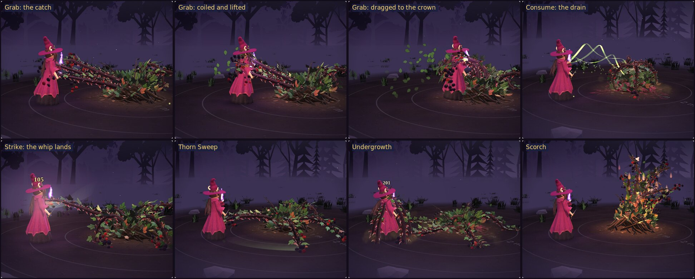
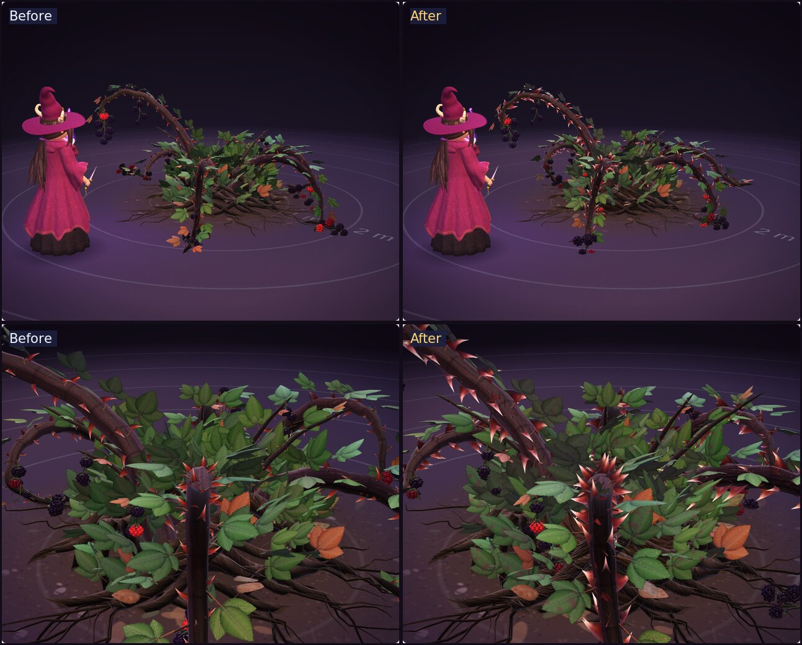
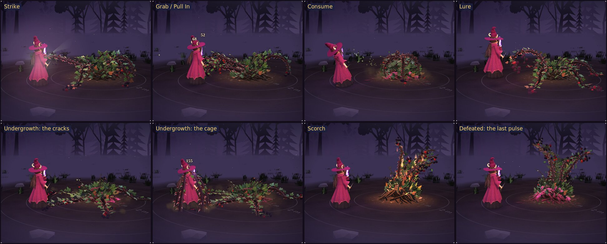
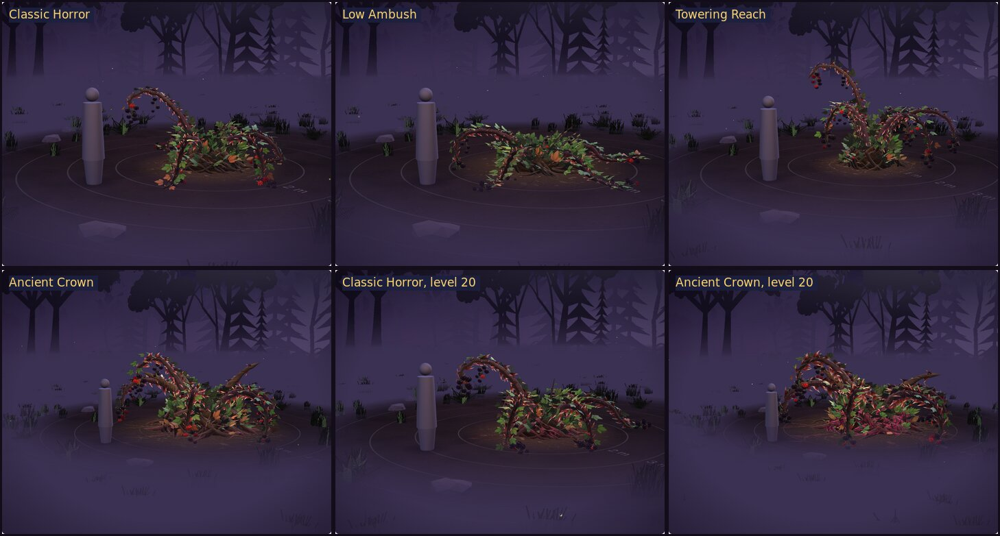

# Bramble Horror

A patient predator of the Wildlands of the Southern Isles. What looks like a lush, unusually fruitful blackberry thicket is a root crown of twisted woody roots with six thorny canes that rise, orient on prey, offer their berries as a lure, lash out, hook with recurved thorns, wrap and drag prey to the crown, and feed through the roots. It has no face: its intent shows only in how the canes move together. Rooted. Patient. Hungry.

**The page:** https://claude.ai/artifact/ASy7Y7hL3EuAHZbFDwihWv (private; it works on a phone). Its boss form, the Bramble Colossus, is in `../bramble-colossus/`. **Before** and **After** at the top switch between the Bramble as it came from its sheets and the polished one. `Bramble_Horror_Bench.html` in this folder is the same page as one file: version 2. `versions/Bramble_Horror_Bench_v1.html` keeps version 1.

## Version 2, October 3, 2026

Once version 1 was finished I looked at what still read weakest in its renders, and changed that:

- **Canes that whip.** Every joint now chases its pose on a spring, stiff near the crown and loose toward the tip, so the canes lag, crack like whips and overshoot instead of moving as one stiff piece. A cane reaching for its prey stiffens, so its Strike still lands exactly on the hit.
- **A real grab.** The canes stretch to reach a far prey, and their tips coil sideways round its body. Grab yanks the prey in as it catches it, lifts it on each squeeze, and drags it into the crown.
- **The drain you can see.** In Consume, three ribbons of stolen life twist out of the prey's chest and down into the hollow, bright knots running along them.
- **A heartbeat.** Once it has shown itself, a slow pulse runs out through its roots every couple of seconds (fainter at level 1, stronger higher up). Disguised at rest, it has none.
- **Growing in, and a scraping sweep.** Appear grows it up out of the soil to full size; Thorn Sweep scrapes dust and clods across the ground in front.

It stays small: 120 KB as written (5 KB more than version 1), 27 KB shrunk and compressed for shipping.





## Version 1, October 3, 2026

Every cane, root, leaf and berry is where the sheets' build put it: the model keeps its own random layout, and everything new draws from a second one.

### Its look

- **Thorns that read from the battle camera.** They are bigger, broad-based and hooked, dark red at the root and ivory at the point, and longer at higher levels. The grasping canes carry a row of big hooks toward their tips.
- **Carved bark and root wood.** The bark's streaks, nodes and lenticels and the roots' twisting fibres catch the moonlight.
- **Its feeding hollow and veins.** The root crown's dome was built inside out in the original, so it never showed from outside; it is fixed, and its top now sinks into a hollow. Its roots carry veins that glow berry-magenta from the crevices: a pulse runs out along them with each gulp in Consume, when it wakes, when it stabs the soil, and once more as it dies. From about level 7 they glow faintly at rest.
- **Leaves** are paler underneath, and some carry wine-dark blotches and rust spots. **The lure's fruit** swells as it gleams.
- **Lighter to draw.** Berries were half its triangles; each drupelet now takes 6 triangles instead of 15 and shades the same from any distance the camera reaches. The Ancient Crown at level 20 went from 131k triangles (over the 120k ceiling) to 109k, with everything above added.

### Its motion

- At rest, now and then one cane lifts its tip and tastes the air, then settles.
- In Strike, the front canes rear and slam with the lead cane; berry juice and bark chips fly where the thorns bite and rip free.
- In Grab, the canes lift the prey on each squeeze and drag it to the crown. The model says where a held prey belongs (`anchor('held')`) and how firmly it is held (`holding`), so the battle can move the prey with it.
- A severed cane's stump bleeds dark sap. Appear heaves the soil. As it dies, its fruit drops.

### Two moves not on the sheets

- **Undergrowth**, a big move for the higher levels. It rears and stabs its canes into the soil. A pulse runs out along its roots, the ground splits toward the prey in three glowing cracks, and thorned shoots burst up round the prey, close over it and squeeze, then sink back as the canes tear free. Blackberries really do root wherever their tips touch the soil; this one does it in a heartbeat.
- **Scorch**, its recoil from fire, which the sheets say it fears. It rears away from the flames, leaves catch and curl black, and it smoulders as it regroups. The char fades over the next few seconds.

### The bench

- **A wild glade,** painted in code: a moonlit forest of oaks, spruces and dead thorn trees sinking into mist, drifting ground mist, grass, ferns and stones round the clearing, and fireflies. **Wild glade** off brings back the plain floor. The light stays the battle screen's Night square rig, or an overcast day.
- **Io as its prey,** from her original model, as on every bench. She takes its blows, steps toward the lure, is lifted and dragged by Grab, is caged by Undergrowth, and cheers when it falls. **Prey** switches to the plain 1.8 m figure or to none.
- **Fight it.** **Sword**: Io lunges with her dagger. **Fire**: she throws her flame and it scorches. **Sever a cane** and **Regrow**. Its HP drives its wilt; at no HP it falls, and any move grows it back.
- **The battle's feel:** big numbers over whoever is hit, gold rings where blows land, a moment of hit-stop and a camera shake on heavy blows, and a flash on Strike and Undergrowth.



## The moves

| Move | Length | Hits | Cues | Notes |
|---|---|---|---|---|
| Appear | 2.4 s | | .42 | Grows up as an ordinary thicket, then reveals itself; the soil heaves and its roots flare. |
| Alert | 1.6 s | | .20 | |
| Lure | 2.6 s | .55 | .32 | The bench shows the hit as "Lured": a charm, not damage. |
| Strike | 1.3 s | .40 | .30 | |
| Grab / Pull In | 2.8 s | .35, .54, .74 | .27 | Holds the prey from about .35 to the end, yanking it in from .4. |
| Consume | 3.2 s | .28, .48, .68 | .38, .58, .78 | Each cue is a heal. |
| Thorn Sweep | 2.0 s | .47 | .32 | Not on the sheets (added with the model): a blow on the whole party. |
| Undergrowth | 3.4 s | .45, .65 | .30, .86 | New. The cues are the canes stabbing the soil and tearing free. |
| Hurt | 0.6 s | | | Interrupt. |
| Scorch (`burn`) | 1.4 s | | | New. Interrupt. |
| Block | 0.5 s | | | Interrupt. |
| Rest | 1.6 s | | | Holds. |
| Defeated (`die`) | 3.8 s | | .34 | Holds. |

The Ancient Crown plays every move 15% slower. The bench's damage numbers are placeholders until the battle steps: level 1 is the Night square's scale (Strike 140, Undergrowth 170 and 230, its HP 1,200), and everything grows 20% a level with a swing of up to 25% either way.



## Numbers

| | As it came | Version 1 | Version 2 |
|---|---|---|---|
| File, as written | 88 KB | 115 KB | 120 KB |
| File, shrunk and compressed | 21 KB | 26 KB | 27 KB |
| Triangles, Classic level 1 to Ancient level 20 | 78k to 131k | 74k to 109k | 74k to 109k |
| Draw calls | 6 body, 7 effects | 6 body, 9 effects | 6 body, 10 effects |
| Bones | 92 to 124 | 120 to 152 | 120 to 152 |
| Textures | 4 (7.3 MB) | 6 (8 MB) | 6 (8 MB) |
| Build time, desktop | 220 to 420 ms | 180 to 320 ms | 170 to 270 ms |
| Animation, per frame | 0.1 to 0.6 ms | 0.1 to 0.35 ms | 0.1 to 0.4 ms |

"Shrunk and compressed" is the file minified and gzipped, the way a finished game would ship it. The bench page is bigger (about 360 KB) because it also carries Io, the original Bramble for the Before switch, and the glade.

Like the original, it has more bones than the spec's ceiling of 64 (its berry bunches swing on bones of their own). That needs bone textures, which every phone with WebGL 2 has.

## Integration card

```text
Model: Bramble Horror   File: 3d-model-new-character-ideas/bramble-horror/bramble.js   Function: makeBramble(opts)
Height: 1.65 m (Classic) to 2.65 m (Ancient, level 20); 4.8 to 8.4 m across with the canes spread
Triangles: 74k to 109k   Bones: 120 to 152   Draw calls: 6 + up to 9 for effects   Textures: 6 (8 MB)
Anchors: chest, head (top), hit (the lead cane's tip), lure (its fruit), crown, hollow, grasp, held, snare, feet, cane0 to cane6
State fields: target ({x, y, z}: the prey's chest), wilt (0 to 1: leaves thin and brown), glow (0 to 1: the fruit's gleam)
Actions: appear 2.4 s cue .42 | alert 1.6 s | lure 2.6 s hit .55 | strike 1.3 s hit .4 | grab 2.8 s hits .35 .54 .74 |
  consume 3.2 s hits .28 .48 .68, heals at .38 .58 .78 | sweep 2.0 s hit .47 | undergrowth 3.4 s hits .45 .65 |
  hurt 0.6 s interrupt | burn 1.4 s interrupt | block 0.5 s interrupt | rest 1.6 s hold | die 3.8 s hold
Walk: the creep, canes as legs; it is rooted, so dash is always 0
Notes: holding (0 to 1) and anchor('held') say where a grabbed prey belongs (Grab yanks it in from about .4, lifts it on
  each squeeze and drags it to the crown at .88); sever() cuts a cane and returns its
  index, regrow() grows them back; opts: variant classic, ambush, towering or ancient; level 1 to 20; detail; size.
```

## Files

| Path | What it is |
|---|---|
| `bramble.js` | The polished model |
| `bramble-horror.html`, `bench.js`, `bench.css` | The bench page's source; it also loads Io's original model from `src/models/originals/witch.js` |
| `glade.js` | The wild glade, `makeGlade()`, written to be reused by other wilderness benches; the Bramble Colossus's bench uses it with a wider clearing |
| `Bramble_Horror_Bench.html` | The built page, one file (version 2) |
| `versions/Bramble_Horror_Bench_v1.html` | Version 1's page, kept as it was delivered |
| `original/Bramble_Horror_Bench.html` | The page as Chris brought it, untouched |
| `original/bramble.js` | Its model, renamed `makeBrambleOriginal` for the Before switch; never edited |
| `renders/` | Before and after, the moves (version 1 and version 2) and the forms, rendered headless from the bench |

## Still open

- **Where it lives.** The sheets call its home the Wildlands of the Southern Isles, which isn't a place in this game yet. `docs/questions/open.md` asks whether it should be a foe, where, and at which levels.
- **The two new moves.** Undergrowth and Scorch are marked as not on the sheets; Chris decides whether they stay.
- **Its sheets.** The model was built from two sheets (`bramble-variants` and `bramble-moves`) that aren't in this repository. Saved in `reference/art/`, they would let the next pass check every view against them.
- **Next touches, if wanted:** its fruit could fall as an item the party picks up, and a painted backdrop of a bramble-choked clearing would replace the glade if it becomes a foe.
