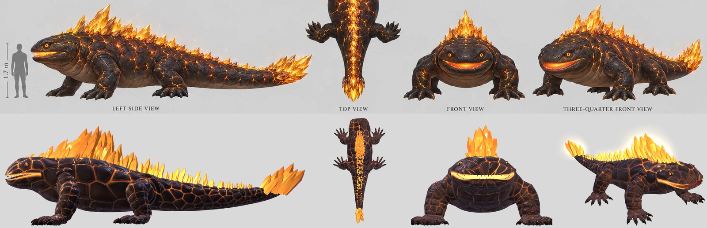
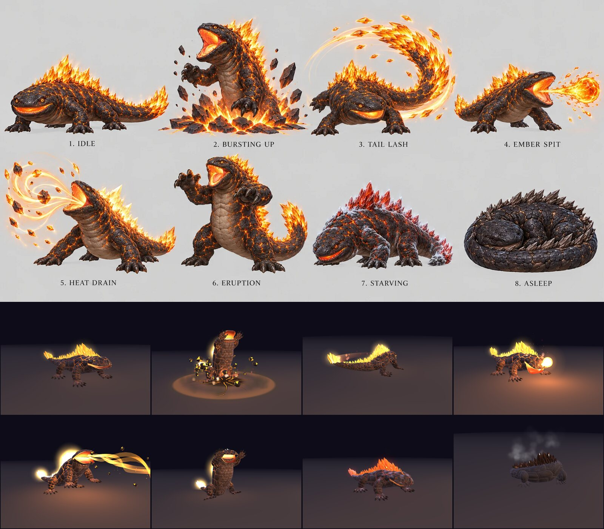

# Emberback

A giant salamander of the Ember Line: about 7 m from snout to tail tip and 1.6 m high at the shoulders, with black hide cracked like cooling lava, molten gold light in every crack, and a ridge of sunstone crystals down its back that ends in a cluster on its tail. It lives in the veins of buried sunstone and basks on lit Warm Road nodes. Noctara's cold is dimming the nodes, so it is starving, and it comes up out of the earth hunting any warmth it can find. Beaten, it curls up asleep and cools to stone, and Sol can relight the node it was guarding (from art request 03, `../../docs/art-requests/03-gloamwing-and-emberback.md`).

It is close to a creature from Chris's D&D campaign. Nothing here is canon until Chris places it (`docs/questions/open.md`, question 5).

**The page:** https://claude.ai/artifact/TBksnXh6X37EoL6F5wWBHo (private; it works on a phone). `Emberback_Bench.html` in this folder is the same page as one file. It opens at ten at night in the wild meadow, with the Emberback bursting up out of the ground in front of Io and Sol.



## What Chris brought

October 3, 2026: the two sheets generated from art request 03, kept as they came in `original/`.

| File | What it is |
|---|---|
| `original/emberback-model.webp` | The model sheet: left side, top, front and three-quarter views with a 1.7 m figure for scale; the head from the front and with its mouth open, the crystal ridge, a front foot, the tail tip's crystals and the cracked, glowing hide |
| `original/emberback-actions.webp` | The action sheet: idle, bursting up out of the ground, Tail Lash, Ember Spit, Heat Drain, Eruption (reared up on its hind legs), starving (dim, red crystals, frost creeping over it) and asleep (curled up and cooled to stone) |

## The model

Built from the sheets, measured off the left side view: 7.0 m long, 1.66 m at the shoulders, the crystals reaching 2.5 m. `emberback.js`, one function, `makeEmberback(opts)`.

- **Its body** is one surface from the snout to the tail's tip, lofted through cross-sections measured off the side, top and front views: a broad flat head, a short thick neck, the hump of its shoulders, a heavy belly that sags low between its legs, and a long thick tail. Its plates are real bumps in the surface, so its outline is lumpy, and they come from the same picture its hide is painted with.
- **Its hide**: black basalt plates, domed and wet-looking, between cracks that glow white-gold in the middle and orange at the edges; some cracks blaze, some are dark seams, and they pool where three plates meet. The glow is brightest along the spine and fades down its flanks, which are a warmer brown, to a tan belly of plates in rows. A slow ripple of light runs down it all the time, and a brighter pulse every few seconds.
- **Its head**: the mouth's line runs from the snout back under the eyes, rising toward the corners into the sheet's smile. The jaw opens on its own bone, the cheeks stretch, and inside is a ridged palate, a broad tongue and a throat that glows like a furnace, with small pointed teeth along both jaws. The lips glow even when it is shut. Small amber eyes with round black pupils sit under heavy brows; the lids blink every few seconds and close when it sleeps. It pumps its throat as it breathes, as salamanders do.
- **Its legs**: four thick, plated legs splayed out like a lizard's, a bulging shoulder or thigh on each, ending in broad feet with five toes and dark hooked claws. The feet stay planted where they stand (each leg works out its own elbow or knee), and it walks as a lizard does, the diagonal pairs stepping together and its body swinging side to side.
- **Its crystals**: about 190 faceted sunstone crystals, small on its brow, biggest over its shoulders, a double row down its back and a fan at the tail's tip like a flame. They glow amber from inside, brightest where they face you, blaze white-gold in its big moves, and carry a soft halo. Embers and faint heat wisps drift up off them.
- **Starving** (`state.starve`, 0 to 1, the bench's **Starving** and **Hunger**): its glow sinks to a dull red, its crystals turn ruby, frost creeps over the top of its back and the tip of its tail, frost glints on it, its breath steams in the cold, and it hunches with its eyes half shut, as on the sheet.
- **Asleep**: when it is beaten it curls up like a cat, its head round to its flank and its tail round to its head, its eyes close, its glow goes out and it cools to dark stone, its crystals smoky brown, steam rising off it. It stays there.

## Its moves

From the action sheet, except Roar and Waking.

| Move | Length | Hits | Cues | What happens |
|---|---|---|---|---|
| Bursting Up (`appear`) | 3.6 s | | .06, .30, .42, .74 | The ground cracks and glows (.06); it bursts out of it front first, reared up, rocks flying (.30), roars (.42) and drops onto all fours (.74). |
| Roar | 1.8 s | | .24 | It rears a little and roars, its crystals flaring. Not on the sheet. |
| Tail Lash | 2.0 s | .55 | .36 | It winds up and spins right round: its tail swings out in a blazing arc through the whole party, flinging off crystal shards. A prey beyond its reach (4.3 m from its middle), it lunges in first and hops back after. |
| Ember Spit | 1.8 s | .62 | .40 | It breathes in, its throat swelling as fire is drawn into its mouth, then throws its head forward and spits a glob of molten fire (it leaves at .42 and lands at .62), which splashes into flame. |
| Heat Drain | 3.6 s | .40, .55, .70 | .18, .86 | It rears, plants its forefeet wide, opens its mouth wide and draws ribbons of fire out of its prey, rocks swirling in them, its crystals blazing white-gold. Each hit is a blow and a heal; it gulps at .86. |
| Eruption | 3.0 s | .58 | .30, .52 | It rears right up on its hind legs, claws raised, and roars (.30); it slams its forefeet down (.52), and the ground splits in a burning line to its prey and erupts under the whole party. |
| Hurt | 0.7 s | | | Interrupt; a small knockback. |
| Block | 0.5 s | | | Interrupt. It hunkers down and turns its crystal back to the blow. |
| Asleep (`die`) | 5.2 s | | .10, .52, .80 | Holds. A last weak roar, then it curls up and cools to stone. It does not fade away. |
| Waking (`wake`) | 3.4 s | | .04, .74 | Its cracks rekindle from its head to its tail, it uncurls and rises with a roar. Not on the sheets: it lets the bench fight it again. Playing `appear` while it sleeps wakes it this way. |



## The bench

- **The party:** Io the Witch and Sol, from their original models, face it in the wild meadow. **Prey** picks which of them its single blows go for; Tail Lash and Eruption strike both, and Eruption throws them into the air.
- **Fight it:** Io's dagger and flame, Sol's Flare Cut and Ember Rush. Fire only half hurts it, marked **Resists**: it drinks heat. Heat Drain heals it. At no HP it falls asleep as stone, the party cheers, and **Wake it** (or any move) rekindles it.
- **Watch a fight:** it and the party take turns by themselves; it wakes again a few seconds after it falls.
- **Sheet poses** holds the action sheet's eight poses one after another, numbered as on the sheet, to set beside it.
- **Sound** (in the header): every sound is made in code by the living battlefield's `sfx.js`, nothing recorded: the ground splitting, its burst, its roars (pitched down), the whirl and whip of its tail, the glob's spit and splash, the drain's hiss and gulp, the slam and the eruption, the party's blades and fire, and the meadow's wind and night insects. Browsers start sound only after a tap; the sounds take a few seconds to make the first time.
- **Place**, **light**, **weather** and **level** as on the other creature benches. In the meadow its blows send shockwaves through the grass, its burst and roars put the birds up, and Tail Lash stirs a whirlwind.

The damage numbers are placeholders until the battle steps: level 1 is the Night square's scale (its HP 4,800, Tail Lash 280, Ember Spit 240, Heat Drain 80 three times with a heal of 140 each, Eruption 330), and everything grows 20% a level with a swing of up to 25% either way.

## Numbers

| | Emberback |
|---|---|
| File, as written | 113 KB |
| Triangles | 55,800 (24,400 at detail 0.5) |
| Bones | 36 |
| Draw calls | 5 for its body, 16 for its effects |
| Textures | its hide (colour, glow, relief), its belly, its eyes, and sprites: about 15 MB |
| Built in | about 0.8 s in a headless browser on this machine |
| A frame | about 0.15 ms to animate |

## For the battle (the Model Build Spec's card)

```text
Model: Emberback   File: emberback.js   Function: makeEmberback(opts)
Height: 1.66 m at the shoulders, 2.5 m to its crystals' tips; 7.0 m long   Triangles: 55.8k   Bones: 36   Draw calls: 21 (5 body + 16 effects)   Textures: about 15 MB
Anchors: chest, head, hit (= tail, its tail's tip), mouth, crest, impact (= erupt, its prey's feet), glob (Ember Spit's glob in flight), feet
State fields: target (its prey's chest: its head, Tail Lash, Ember Spit, Heat Drain and Eruption aim at it); heat (0 to 2: how bright its cracks burn, 1 at rest); starve (0 to 1: dim, dull red, ruby crystals, frost, steaming breath, hunched)
Actions: appear 3.6 s cues [.06, .30, .42, .74]; roar 1.8 s cue [.24]; tailLash 2.0 s hits [.55] cue [.36]; emberSpit 1.8 s hits [.62] cue [.40]; heatDrain 3.6 s hits [.40, .55, .70] cues [.18, .86]; eruption 3.0 s hits [.58] cues [.30, .52]; hurt 0.7 s interrupt; block 0.5 s interrupt; die 5.2 s hold, interrupt, cues [.10, .52, .80]; wake 3.4 s cues [.04, .74]
Walk: a lizard's walk, the diagonal pairs together; its feet stay planted at the game's pace (phase = metres x 4.4); about 1.1 m/s looks right
Notes: die does not fade it: beaten, it stays as stone (asleep is true, gone is false); play('appear') or play('wake') rekindles it, and setFade still hides it. Tail Lash moves it through dash, in and back out; hurt knocks it back about 0.4 m and Eruption lunges about 0.4 m. Its glob and the eruption under its prey are its own effects, timed to the hits. Two point lights live in fx (its glow, and its fire), always present.
```

## Still open

- Where it lives and when the party meet it, and whether fire hurts it, feeds it, or (as the bench has it) only half hurts it (`docs/questions/open.md`, question 5).
- Whether it ever wakes again, for instance when Sol relights its node; the bench's Waking is only so it can be fought again.
- The reared poses (Bursting Up, Eruption) are a little straight-backed next to the sheet's rounder, leaning ones.
- It could fight in the living battlefield (`../../living-battlefields/`) as the Colossus does.
