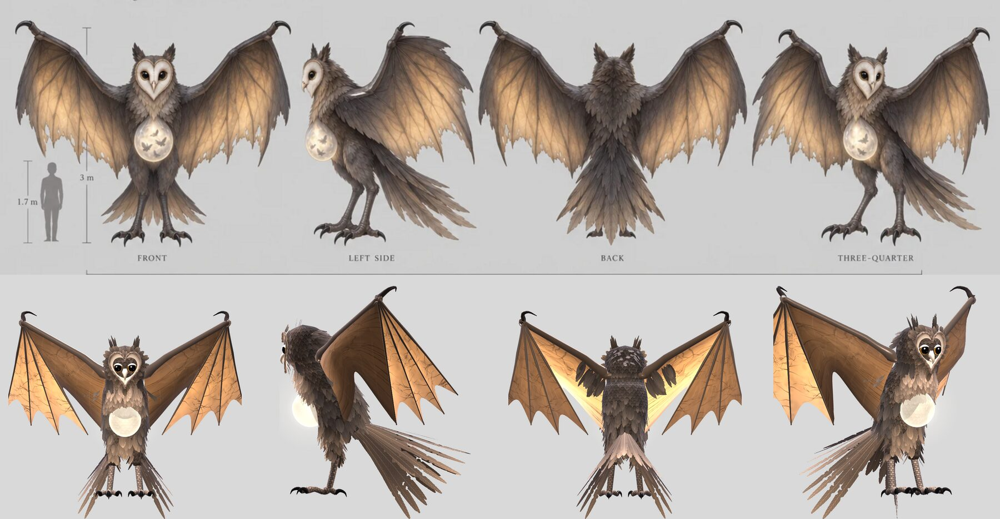
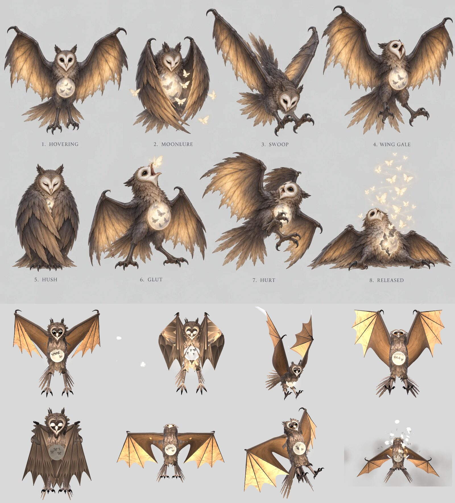

# Gloamwing

A great night-flier of the marshes that hunts the pale moths that are souls on their way to the Moon: about 3 m tall standing and 9 m from wingtip to wingtip, with a heart-shaped barn owl's face, smoky brown down, bat-like wings that glow amber where light shines through them, and under its chest a glowing sac like a small moon where the souls it has swallowed flutter. Beaten, it lets them all go (from art request 09, `../../docs/art-requests/09-gloamwing-and-emberback.md`, and the Lore & Party Bible's Hollow: "The Gloamwing grows fat on soul-light that should have gone up"). Nothing here is canon until Chris places it (`docs/questions/open.md`, question 6).

**The page:** https://claude.ai/artifact/NMbNDwKCSzLbX9DZurydWc (private; it works on a phone). `Gloamwing_Bench.html` in this folder is the same page as one file. It opens at ten at night in the wild meadow, with the Gloamwing coming down out of the dark in front of Io and Sol.



## What Chris brought

October 3, 2026: the two sheets generated from art request 09, kept as they came in `original/`.

| File | What it is |
|---|---|
| `original/gloamwing-model.webp` | The model sheet: front, left side, back and three-quarter views with a 1.7 m figure for scale (3 m tall, 9 m wingspan); the head from the front and in profile, a wing folded and a wing open with light through it, the moon-sac with moths inside, a foot |
| `original/gloamwing-actions.webp` | The action sheet: hovering, Moonlure (wings wrapped round the glowing sac, moths drawn in), Swoop, Wing Gale, Hush (wings folded tight like a shroud), Glut (swallowing a moth), hurt, and released (fallen, the sac split open and the moths rising out of it) |

## The model

Built from the sheets, measured off the front and side views at their 3 m scale: its ear tufts reach 2.75 m and its wrists 2.9 m when it stands, and its wings span 9 m spread flat. `gloamwing.js`, one function, `makeGloamwing(opts)`.

- **Its body and head** are one surface from under its tail to its crown, lofted through cross-sections measured off the front and side views: a deep, hunched chest, a round belly, and a big round head set low between its shoulders, as an owl's is. Over it lie about 700 feather cards: a paler bib under its face, darker shoulders, back and flanks, a ruff round its face, two dark ear tufts and shaggy feathered thighs. Its down is dark smoky grey-brown, paler and warmer on the breast.
- **Its face**: a heart-shaped disc, ivory and softly greyer toward a thin tan rim, a little dished. Two huge black eyes with a thin ring of gold and wet highlights; the lids blink every few seconds and close in Moonlure and Hush. A small hooked ivory beak whose lower half drops open. Its head turns to its prey in quick owl's snaps, holds, glances away and now and then cocks to one side.
- **Its wings**: a long leathery arm from the shoulder to a hooked claw at the wrist, and four long two-jointed fingers, with thin skin between them and down to its flank. The skin is warm tan, darker by the bones, with branching veins, a torn trailing edge and holes worn through, and it glows amber where light comes through it. Folded round itself (Moonlure, Hush, Block) the wing looks like the sheet's folded wing: layers of long dark feathers with tan edges.
- **Its hover** is the sheet's: wings raised, the skin hanging from the arms and facing forward, the fingers pointing down. Its wingbeat is slow and deep (1.25 s): a quick downstroke, the wings dropping, sweeping forward and turning their skin to the ground, then a slow lift. Its body rises with each downstroke, its tail sways on a spring and its legs hang and swing below it.
- **Its legs**: feathered thighs, long scaly grey shanks and big feet, three toes forward and one back, each with a long hooked black talon. They hang open in flight and plant themselves on the ground when it lands (each leg works out its own knee).
- **Its tail**: a broad fan of long plumes, pale at their tips, sweeping down and back nearly to the ground.
- **Its moon-sac** hangs under its chest: a pale full moon with grey seas, glowing and lighting its own breast and whoever stands before it, with the dark shapes of the souls it has swallowed fluttering inside (`state.moths`, 0 to 9; the bench's **Souls**). Moonlure adds two, Glut one. Beaten, the sac cracks with light and splits, and every soul flies out of it.

## Its moves

From the action sheet, except Rising.

| Move | Length | Hits | Cues | What happens |
|---|---|---|---|---|
| Gloaming (`appear`) | 3.8 s | | .56, .80 | It comes down out of the dark on spread wings and glides in, throws its wings up to brake with a screech (.56) and a great downbeat, and settles into its hover as its sac lights up (.80). |
| Moonlure | 3.6 s | .62 | .20, .45 | It wraps its wings forward round its sac like a cloak (.20) and shuts its eyes. The sac blazes (.45), and pale moths drift in to it out of the dark, some from its prey. The hit is a lure on the whole party, with no damage. Two more souls in its sac. |
| Swoop | 2.4 s | .50 | .22 | It throws its wings up and rises, screeches (.22), then dives at its prey with its wings high and swept back and its talons thrust forward, rakes her (.50) and pulls up and back to its place with a great downbeat. Its dash carries it there and back. |
| Wing Gale | 2.6 s | .46 | .30 | It rears up in the air with its wings high and screeches (.30); one huge downbeat drives a blast of wind over the whole party: a ring of dust, streaks of wind over the ground and feathers. |
| Hush | 3.2 s | .55 | .25, .88 | It lands and folds its wings tight round itself like a shroud (.25), eyes half shut, its sac's light hidden; a ring of dusk rolls out over the party, a silence with no damage (.55). It lifts off again (.88). |
| Glut | 2.8 s | .50 | .55 | It lands, spreads its wings low and throws its head back: a glowing moth is torn out of its prey's light (the blow, .50) and flies up into its beak; it snaps it up (.55), its sac brightens with one more soul inside, and it heals. |
| Hurt | 0.7 s | | | Interrupt. Knocked back in the air, one wing up and one down, feathers flying. |
| Block | 0.5 s | | | Interrupt. It draws its wings forward round itself. |
| Released (`die`) | 5.6 s | | .30, .45, .70 | Holds. It falls out of the air and lies with its wings spread on the ground (.30); its sac splits open (.45) and all the souls inside rise out of it in a spiral of pale moths, up and away to the Moon. It does not fade away. |
| Rising (`rise`) | 2.6 s | | .05, .50 | Its sac fills with light again and it beats up off the ground. Not on the sheets: it lets the bench fight it again. Playing `appear` while it is down plays this. |



## The bench

- **The party:** Io the Witch and Sol, from their original models, face it in the wild meadow. It turns to face its prey. **Prey** picks which of them Swoop and Glut go for; Wing Gale blows both of them back, and Moonlure and Hush reach them both (marked **Lured** and **Hushed**; Moonlure draws them a step toward it).
- **Fight it:** Io's dagger and flame, Sol's Flare Cut and Ember Rush. Glut heals it. At no HP it falls and lets its souls go, the party cheers, and **Rise again** (or any move) brings it back.
- **Watch a fight:** it and the party take turns by themselves; it rises again a few seconds after it falls.
- **Souls** sets how many souls flutter in its sac (it shows **Full** from seven).
- **Sheet poses** holds the action sheet's eight poses one after another, numbered as on the sheet, to set beside it.
- **Sound** (in the header): every sound is made in code by the living battlefield's `sfx.js`, nothing recorded: a deep whoosh at every wingbeat, its screeches, the wrap of its wings, the sac's chime, the rake of its talons, the gale's blast and the rustling grass, the gulp, its fall, the souls fluttering up, the party's blades and fire, and the meadow's wind and night insects. Browsers start sound only after a tap; the sounds take a few seconds to make the first time.
- **Place**, **light**, **weather** and **level** as on the other creature benches. In the meadow its gale flattens the grass in a ring, stirs a whirlwind and shakes the trees, its screeches put the birds up, and its fall sends a shockwave through the grass.

The damage numbers are placeholders until the battle steps: level 1 is the Night square's scale (its HP 4,200, Swoop 260, Wing Gale 170 to each, Glut 150 with a heal of 300), and everything grows 20% a level with a swing of up to 25% either way.

## Numbers

| | Gloamwing |
|---|---|
| File, as written | 100 KB |
| Triangles | 47,000 (14,700 at detail 0.5) |
| Bones | 41 |
| Draw calls | 10 for its body and sac, 9 for its effects |
| Textures | its down (colour and relief), its feathers, its face, its eyes, its wing's skin and its folded feathers, its scales, its moon, and sprites: about 7 MB |
| Built in | about 0.15 s in a headless browser on this machine |
| A frame | about 0.07 ms to animate |

## For the battle (the Model Build Spec's card)

```text
Model: Gloamwing   File: gloamwing.js   Function: makeGloamwing(opts)
Height: 3 m standing (its ear tufts 2.75 m, its wrists 2.9 m); it hovers with its feet about 1 m up, its head at about 3.6 m; 9 m wingspan   Triangles: 47.0k   Bones: 41   Draw calls: 19 (10 body + 9 effects)   Textures: about 7 MB
Anchors: chest, head, hit (= talons, Swoop), beak (= mouth), sac (= moon), wingL and wingR (its wingtips), impact (its prey's feet), feet
State fields: target (its prey's chest: its head turns to it, and Swoop, Glut and Moonlure aim at it); moths (0 to 9: the souls in its sac; Moonlure adds two, Glut one, Released lets them all go; appear and rise give it at least four)
Actions: appear 3.8 s cues [.56, .80]; moonlure 3.6 s hits [.62] cues [.20, .45]; swoop 2.4 s hits [.50] cue [.22]; wingGale 2.6 s hits [.46] cue [.30]; hush 3.2 s hits [.55] cues [.25, .88]; glut 2.8 s hits [.50] cue [.55]; hurt 0.7 s interrupt; block 0.5 s interrupt; die 5.6 s hold, interrupt, cues [.30, .45, .70]; rise 2.6 s cues [.05, .50]
Walk: it flies and never walks: animate(phase, walk) with walk 1 leans it forward and quickens its wingbeat; move its root at any pace (the bench flies it home at up to 3 m/s).
Notes: die does not fade it: beaten, it lies on the ground (down is true, gone is false); play('appear') or play('rise') brings it back, and setFade still hides it. Swoop moves it through dash along its facing, in to 1.3 m short of its prey and back; hurt knocks it back about 0.35 m. Turn its root to face its prey (the bench does). lift is its height off the ground, for its shadow; beats counts its wingbeats, for a whoosh at each. Hush and Glut land it (its feet plant themselves). One point light lives in fx (its sac's glow), always present.
```

## Still open

- Where the party meet it and at which level, and what Moonlure and Hush do in a fight (`docs/questions/open.md`, question 6).
- Whether it stays down when beaten or flies off; the bench's Rising is only so it can be fought again.
- Its sac follows the sheet's warm ivory, where the art request asked for moon-silver.
- Its wings are posed by fitting its bones to the sheets (the hover, the cloak of Moonlure and the shroud of Hush), so a few in-between frames of the bigger folds pass through odd shapes for a moment. Moonlure's wrap is narrower than the sheet's, and its moths are fewer.
- It could fight in the living battlefield (`../../living-battlefields/`) as the Colossus does.
