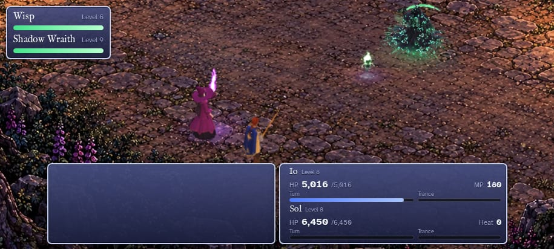

# Envoi on the Longest Night: The Final Draft

Started October 4, 2026, when Chris sent the file he keeps and called it the final draft. This folder keeps that file exactly as it is, a review of the game as it stands, what would make it richer within the 30 MB the file may grow to, and the **model studio**: how the game's session gets new 3D creatures built by several modeling sessions at once, through Chris.

## The file

`Envoi-on-the-Longest-Night.html`, 16.3 MB, as Chris sent it.

- It is byte for byte what the repository builds at commit `1ae47db` with `node tools/build.mjs --min --offline putting-it-all-together/game.html` (SHA-256 `6396cfccb21a941deed0a467efc17c3c0f202dc682f61ebe6dc661a88798207c`). So the source here makes exactly this file, and nothing in it exists only in the file.
- It works with no internet: three.js, the fonts, every picture and both of Chris's songs are inside.
- This branch, `ccr-31761774-76j8j3`, carries the game from `claude/practical-franklin-l1ctf9` (where `1ae47db` is), with this folder on top.

## How it plays today

Played headless at a Pixel 7a's size (915 × 412) with the internet blocked, on October 4:

- the title, a new game, walking (holding to steer, tapping, the pad), the world map, every menu tab;
- the four staged scenes (Sol over the bridge, Quill at the jetty, the knight at the crossroads, Ysmera at the slip);
- both hidden keepsakes, found by tapping along Chris's secret ways;
- saving, and Continue on the title;
- two wild fights played to a win, band 1 at level 3 and band 2 at level 8, and back to the map.

No errors. One run stumbled, but on the test's own fault: it started a fight from the title screen through a test hook, which can't happen in play. The same fight from a new game passed.

## What's in it

| | |
|---|---|
| Places to walk | 13 painted maps: 7 towns and homes, 3 gates, 3 wild places; the world map between them, walked on foot and flown by the Magpie |
| People | 17 townsfolk, each with a line or two that changes as the story moves on |
| Things to find | 5 letters at small wells, 3 Ember Line nodes to relight, 2 hidden keepsakes |
| Things to carry | 5 herbs, a herb shop in each town, the Magpie's 3 upgrades |
| Foes | Wisps, frost wisps, wraiths, the great wraith, the Bramble Horror in four forms, the Bramble Colossus, Halcyon, Noctara |
| Length | About five hours; about 50 wild fights for an attentive player (the journey simulation) |

## What's thin

1. **The wilds.** About nine wild fights in ten are against the same three foes: wisps, frost wisps and wraiths, all of them Noctara's. Bands 1 and 2 have nothing else at all. The Bramble Horror is one fight in five in band 3, the Colossus one in twelve in band 4.
2. **Finding things.** Five letters, three nodes and two keepsakes over five hours. The named places on Chris's D&D map (Mosswatch Tower, Rotbridge, Willowmurk, Fawnrest Shrine, Eldergrove, Frostmere Lake, Peak's Veil, Stormwatch) are on the flying map, but there is nothing to visit at any of them.
3. **The words.** Every line is still a placeholder, waiting for the lore conversation.
4. **The art still to come.** Sixteen townsfolk portraits and nine story stills (art requests 06 and 07).
5. **Walking the wilds.** Bands 2 and 3 are walked on the world map, which Chris wants to be for flying only; painted wilderness scenes would replace it once he answers `../docs/questions/open.md` 20 and 21 (art request 12).
6. **Small foes on the phone.** In a wild fight the pack stands small near the top of the screen (a wisp is about 20 pixels tall in the picture above). Anything new should be at least about a meter tall, and the battle camera could frame packs a little closer.

## The 30 MB

Where today's 16.3 MB goes, measured in the file:

| Part | MB |
|---|---|
| The world map: its walking tiles 2.6, the flight's map 1.1, the clouds 0.3 | 3.9 |
| The 13 walking maps and Io's walk sheet | 3.8 |
| The 9 battle paintings | 3.0 |
| Chris's two songs | 1.9 |
| Code: three.js 0.6, the 3D models 0.7, the Magpie 0.2, everything else 0.3 | 1.8 |
| The title picture, three portraits and the fonts | 1.0 |
| The 19 paper dolls and their faces | 0.9 |

What a new piece costs in the file:

| Piece | MB each |
|---|---|
| A 3D creature, built in code with all its moves | 0.06 to 0.09 |
| A wild walking scene (squeezed as the wild maps are) | 0.07 to 0.15 |
| A town walking scene | 0.2 to 0.45 |
| A battle painting at Chris's "Strong" squeeze | about 0.04 |
| A song (like Chris's, about 3 to 4 minutes) | about 1 |

What's already planned takes the file to **about 15 to 17 MB** (pass three's measure): the portraits and stills add 2 to 3, and the new battles (their paintings at Strong) and painted wilderness scenes in place of walking the world map take off about 3.5. That leaves **about 13 MB** for more game. One way to spend it:

| More game | MB |
|---|---|
| Ten creature families (thirteen creatures, with their great forms) | 0.8 |
| The D&D map's named places as walking scenes, each with things to find | 1 to 2.5 |
| A battle painting for each of those places | 0.4 |
| Three or four more of Chris's songs: a theme for each band's wilds, one for the great creatures | 3 to 4 |
| **All of it** | **about 6 to 8: the file at about 22 to 25 MB** |

**The file's size isn't what limits the creatures:** the phone's drawing power is. A fight has to draw five models at once on the Pixel 7a, so each creature has a budget of triangles and draw calls in its brief.

## What I'd work on, in order

1. **The wild's own creatures.** Ten families, mostly Chris's own from his Aethermoor games, brought into this story, in three waves: `../docs/art-requests/13-wild-creatures.md` has the image prompts, and `model-studio/` has a brief for each. Wave 1 fills bands 1 and 2, which have none. The rule that holds them together is Chris's: the closer to Noctara, the more upset the wild, so every creature has a frost-touched look the game turns up band by band.
2. **Things to find at the named places.** Each band gets its landmarks, each with something to find: a letter at a well, a herb, a keepsake, and a great creature's lair:

   | Band | Landmarks | Its great creature (an optional fight) |
   |---|---|---|
   | 1 | Willowmurk, Rotbridge, Mosswatch Tower | Gorrow, the Mire-King, at Willowmurk; Old Jaws under Rotbridge |
   | 2 | The Warm Roads' dark nodes | Old Snag on the moor |
   | 3 | Fawnrest Shrine, Eldergrove | The White Hart of Fawnrest |
   | 4 | Frostmere Lake, Peak's Veil, Stormwatch | The Thunder-Roc of Stormwatch (and the Colossus, as now) |

   Their walking scenes would join art request 12 once Chris answers questions 20 and 21.
3. **Field notes.** A menu tab where Io notes every creature the party has calmed and every place it has found, with how many of each. It makes the finding count, and needs no art.
4. **Errands and keepsakes.** Townsfolk asks tied to the creatures and places, and **the twenty keepsakes** (Chris's plan, October 4, evening): `items/README.md`. Each great creature leaves one of them, and as with the two hidden now, the balance never counts on any.
5. **The new battles,** as pass three planned them: 3D ground in front, Chris's paintings far off behind.
6. **Small polish:**
   - auto-advance for the words;
   - the ending's "Even the ones at the wells" said only when Io found them;
   - Chapters unlocking once the game is beaten (Chris's rule, for the finishing pass);
   - quicker fight starts, by keeping the heroes built between fights;
   - a door's sound when a map changes;
   - packs framed a little closer on the phone.
7. **On Chris's side:** the lore conversation (every word), the sheets for art request 13, the keepsakes' places (the Item Places page) and pictures (art request 14), art requests 06 and 07, and questions 20, 21 and 24 to 32 in `../docs/questions/open.md`.

## The model studio

`model-studio/README.md` has the whole loop. In short: Chris generates a creature's two sheets, starts a new session with that creature's starter message and the sheets, plays with its bench page on his phone until he's happy, and brings its return slip back to the game's session, which puts the creature into the game. Each modeling session works only in its own folder, so several can run at once. The same loop builds anything else the game needs, from a blank brief.

## Cutscenes

`cutscenes/README.md` answers Chris's question from October 4, evening: yes, the game can have cutscenes like the field study's film, shorter (under a minute before a fight) and lighter (a Phone detail that holds 30 frames a second). It has a brief and a starter message for two, each made by its own session in its own folder: **the Colossus, first met** (the first time the party meets it beside the frozen road) and **the finale's opening** (the camera coming in from far off onto Io and Sol, Noctara and Halcyon at the dead Moonwell). To give those sessions what they build on, this branch now also carries `3d-cutscenes/` (from `claude/quirky-newton-dr3w1q`), and `3d-model-field-studies/` and `3d-model-main-characters/` (from `claude/confident-albattani-nhdy6e`). Chris's Colossus battle page is kept in `../reference/demos/bramble-colossus-battle.html`.

## The twenty keepsakes

`items/README.md` has Chris's plan from October 4, evening: twenty things to find, each with a still picture, that Io and Sol put on and take off on a new Items page. Six are Io's alone, six Sol's alone, and eight either can wear, so one hero can wear fourteen if the party finds them all. Sixteen of them reach the totals the two hidden keepsakes give today (Io's healing 25% more, Sol's HP and blows 10% each), in sizes from 1% to 6.25%, with the two hidden ones among them, cut to a quarter. The other four are special: a Trance item for each hero, and two rings. Every name, look and line is one of Chris's Aethermoor or Thareia relics, brought into this story (`items/items.js`).

Chris places them himself on **Item Places** (`item-places/`, https://claude.ai/artifact/M3PokTZsXbbxbx2BSDSrC5), a version of the Walking Paths page that checks each spot with the game's own walking rules and lets him walk Io to it; his places come back through the page's database. The pictures are art request 14 (`../docs/art-requests/14-keepsake-items.md`). Nothing is in the game until he has placed them and agreed the list (`../docs/questions/open.md`, 30 to 32).

## For the next session working on the game

1. `../docs/next-session.md` is still where the game stands; this folder is the newest work on top of it.
2. Then `model-studio/README.md` (the board: which creature is where) and `model-studio/intake.md` (bringing a finished one in).
3. The repository's default branch is still the old phase 1 state. Chris decides when the game goes there.

## Files

| Path | What it is |
|---|---|
| `Envoi-on-the-Longest-Night.html` | The final draft, as Chris keeps it |
| `renders/` | Screenshots from the phone-size playthrough |
| `model-studio/` | The model studio: the briefs, the return slip, the intake |
| `cutscenes/` | The cutscene plan, a brief for each, and their sessions' folders |
| `../docs/art-requests/13-wild-creatures.md` | The image prompts for the ten creature families |
| `items/` | The twenty keepsakes: the list (`items.js`) and the plan |
| `item-places/` | The Item Places page, where Chris puts the keepsakes on the maps |
| `../docs/art-requests/14-keepsake-items.md` | The image prompts for the twenty keepsakes' pictures |
