# The New Battles

Chris, October 4, 2026: "we have a bunch of battle backgrounds that are supposed to go with the Colossus in the meadow fight arena, so take the Colossus out and put all of the fights into an arena like that, with the different battle backgrounds."

This is that, as a demo page first: **every fight of the game, in its place**, fought the way Colossus in the Meadow is. Your painting of the place stands far off behind, and live 3D ground stands in front of it and answers every blow. The fights themselves are the game's own: the same moves, rules, menus, windows and words, and the same 3D models (Io exactly as she is).

The game itself hasn't changed yet. It switches over once you've played the demo and said yes (how, at the end).

## The page

**https://claude.ai/artifact/FHpBiFsEhvUgvmu5hJaCea** (published October 5, with the game's latest in it). It is `demos/arena.html`, built into `dist/arena.html` (and `dist/arena.artifact.html`, the copy that is published).

- Pick a fight: the first fight, the wilds of each band, the Bramble Horror, the Bramble Colossus, gates 5, 10 and 15, or the finale. The list shows each place's painting.
- Pick the party's level, the foes (or let the wilds roll them, as the game does), and the weather (or let it come as it comes).
- **Play** it, choosing every move, or **Watch** it play itself.
- It runs at your settings: 30 frames a second, the 3D at 3/4 sharpness, the paintings at Strong. The painting behind stays sharp: it's drawn the way the battles draw theirs today, and the live 3D layer goes over it.
- The fps button in the corner changes the frame rate (the screen's own, 60, 45 or 30), as in the game. **Fights** goes back to the list.
- The **Sharpness** button beside it changes how sharp the 3D is drawn: 3/4 (yours), Half or Full, at once, even in the middle of a fight. The painting behind always stays sharp. Half is the lever for a fight that runs slow: it draws the 3D with fewer than half the dots that 3/4 does. The page remembers your pick, and the game's Settings has the same choice, **Battle sharpness**, beside Battle frame rate. (Added October 5, after the page was published: it is on the page once it is published again.)
- It works on the phone held sideways (915 × 412, a Pixel 7a) and on a laptop.

## What changes in a fight

- **The camera** stands where the paintings were painted from: at eye height, in front of the fight, with the painting's own lens. It never moves. Every shot is a crop of that one frame, as the battle's shots are of a painting today. The party stands lower left, the foes upper right.
- **The ground is alive.** Every blow ripples the grass round whoever it lands on and throws up a little turf and dust. Big blows split the ground (the cracks glow), throw clods and stones, shake the trees and put the birds or bats up. Spells light the ground round them, and their rings run through the grass as shockwaves.
- **The painting is alive.** Clouds drift over the moon, a storm can roll in over the sky, lightning lights everything, the wind's gusts and the shockwaves sweep the far grass in the painting, cloud shadows cross it, and rain darkens it.
- **Weather in the wilds:** now and then (one wild fight in four) rain or a storm. In the frozen places a storm is a blizzard. The gates are fought in clear weather, unless you pick another on the page.
- **The Colossus's Wrath:** the sky darkens and reddens, a red storm blows in with its rain, and red lightning comes down round the fight now and then, never on anyone.
- **The foes are bigger on the phone** than in today's fights, which the review asked for: a wisp stands about 30 to 35 pixels tall in the shot every turn opens on, against about 20, and more in a close-up.
- **The menus don't hide the fight.** While a command is chosen, the view slides down until everyone's feet are above the menus. With Io's seven commands on the phone that takes it past the painting's bottom edge, where the painting's nearest ground is drawn again, mirrored and in shadow, behind the menus.
- **The shots don't zoom in as far** as today's: the painting is never blown up past half as big again as its widest, so it stays sharp.

## Each place

| Fight | Place (painting) | Live ground | Its air |
|---|---|---|---|
| Band 1 wilds, levels 1 to 5 | Wickhollow's river glade (01) | meadow grass, clover, pale flowers; an old oak on the right | mist off the river, fireflies, bats |
| Band 2 wilds, 6 to 10 | The Warm Roads' moor (11) | moor grass, heather, gorse; a birch on the right | warm sparks off the Ember Line, whose veins and waymarker pulse; birds |
| Band 3 wilds, 11 to 15, and the Bramble Horror | Eldergrove's clearing (02) | woodland grass, ferns, clover, moss; a great oak on the right | thick mist, fireflies, the embers in the old trees' hollows pulsing; bats |
| Band 4 wilds, 16 to 20, and the Bramble Colossus | Frostmere's shore (05) | frosted grass; a snowy pine on the right edge | light snow, frost glinting; a storm is a blizzard; birds |
| Gate 5: the great wraith | Bogmire (03) | a boardwalk on stilts over black water that mirrors the painting; reeds round it; two lanterns burning low | thick fen mist, green marsh lights, bats; every lamp in the town is dark until the great wraith falls, and they light again as their light flies home |
| Gate 10: three wraiths | Dawnroost's living node (12) | the yard's own flagstones and packed earth, weeds in the gaps | the node pulses and throws its warm light on the fight, warm sparks drift over the yard; birds |
| Gate 15: Halcyon | The northern crossroads (13) | frosted dead grass and moss; a dead tree on the right | a little snow, frost glinting, a cold wind; birds |
| The finale | The dead Moonwell (14) | the court's own frosted flagstones, rimed weeds in the cracks | freezing mist, snow, frost glinting; bats; no warmth. The stars come back over its sky if the fight is won |

No place has stars in its sky until the finale is won.

Band 1's wild fights in the Thornwood, which today play on the Thornwood bridge's painting, are fought in the river glade too, as art request 11 has it (each band's wilds in one place).

**The first fight** keeps the Night square's own painting, as question 23 has it (`../../docs/questions/open.md`). That painting looks down on the square from high above, and the fight stands on its painted cobbles among the well, the lamps and the walls. An arena's live ground needs a painting seen from eye height, its ground running away to a far horizon, so live cobbles in front of this one would never meet it. It stays as it is and plays exactly as today.

**Lunara** rises behind the foes in every place, from the moonlight (or the black water at Bogmire, and the dead Moonwell in the finale), and **Envoi** folds in between the party and the foes, as on its bench.

## What it costs the phone

The test browser can't tell how fast a fight runs on your phone; what it can count is what each frame asks of it: how many things are drawn (draw calls) and how many triangles. Each fight was counted at 915 × 412 at the shot every turn opens on, the whole field with the party and its foes in view; "the arena's part" is the same frame counted again without the arena (the ground, tree, water, air and the sheet over the painting).

| Fight | Place | Weather | Who | Draw calls | Triangles | The arena's part |
|---|---|---|---|---|---|---|
| The first fight | the Night square (flat, as today) | | Io, a wraith | 84 | 156,000 | |
| Band 1 wilds | the river glade | a storm | Io, Sol, a wisp, a wraith | 111 | 298,000 | 14 and 28,000 |
| Band 2 wilds | the Warm Roads' moor | a storm | Io, Sol, a wraith, two wisps | 121 | 314,000 | 14 and 27,000 |
| Band 3 wilds | Eldergrove | clear | Io, Sol, a wraith, a frost wisp | 110 | 291,000 | 13 and 21,000 |
| Band 4 wilds | Frostmere | clear | Io, Sol, three frost wisps | 115 | 264,000 | 14 and 20,000 |
| The Bramble Horror | Eldergrove | clear | Io, Sol, the Horror (its low ambush) | 96 | 290,000 | 12 and 18,000 |
| The Bramble Colossus | Frostmere | a blizzard | Io, Sol, the Colossus | 100 | 319,000 | 13 and 17,000 |
| Gate 5 | Bogmire | clear | Io, Sol, the great wraith | 112 | 269,000 | 20 and 7,000 |
| Gate 10 | Dawnroost's node | clear | Io, Sol, three wraiths | 129 | 378,000 | 10 and 6,000 |
| Gate 15 | the northern crossroads | clear | Io, Sol, Halcyon | 110 | 305,000 | 12 and 20,000 |
| The finale | the dead Moonwell | clear | Io, Sol, Halcyon, Noctara | 155 | 370,000 | 11 and 2,000 |

Counted again on October 5, after the tidy-up below, with the wilds' foes and weather rolled the same way as in a count just before it (`node tools/arena-test.mjs --seed 5`). Two wilds rolled a storm, whose rain costs one more draw call and 6,400 triangles, and the Colossus a blizzard. Other rolls, counted on October 4 and 5: in clear weather the river glade 114 and 266,000 with three wisps, the moor 116 and 333,000 with two wraiths; Eldergrove in a storm 121 and 314,000 with a wraith and two wisps.

For comparison: Colossus in the Meadow, which you measured at 29 to 30 frames a second on your phone even in the storm, draws 96 things and 319,000 triangles; today's first fight, 83 and 156,000. The arena's own part is small, 10 to 20 draw calls and 2,000 to 28,000 triangles; most of every frame is the fighters themselves, as in today's fights, and they are the same models.

**The tidy-up** (October 5). The arena leaves out its stones and clods while none are up, and its birds or bats while none fly: two things fewer to draw and about 2,900 triangles fewer in every quiet moment of a fight. The counts above are taken at a command just after a turn's blows, while the birds are still up, so they show less of it: in five of the ten arena fights no stones were up, and the arena's part counted one draw call and 2,800 triangles fewer than the same fight before the tidy-up; in the other five it counted the same. The rain's puddles and ripples on the painted ground are only worked out now while it rains (dry, they came to nothing). None of it changes the picture: every place was drawn with the arena before and after, on a clear night, in a storm and just after a heavy blow, and not one dot changed.

The lever for a fight that runs slow is the **Sharpness** button (The page, above): at Half, the 3D layer is drawn with under half the dots of 3/4, which every frame pays for, while these counts stay the same.

Each fight takes a little longer to set up than today: its arena is built while the "Setting the scene…" card shows, about a tenth more than the fighters' own build, which every fight already pays. It never slows the fight itself.

The demo page is 2.2 MB, the eight paintings 0.33 MB of it (250 KB as files; written into the page they take a third more).

## Pictures

Each place mid-fight on the phone (915 × 412), watched as the expert plays, from `renders/`:

| | |
|---|---|
| 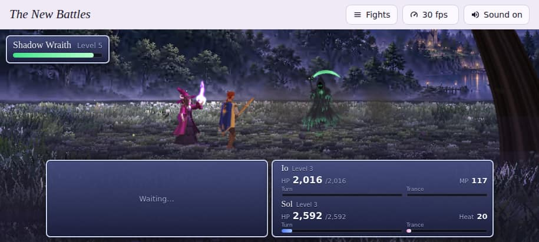 | 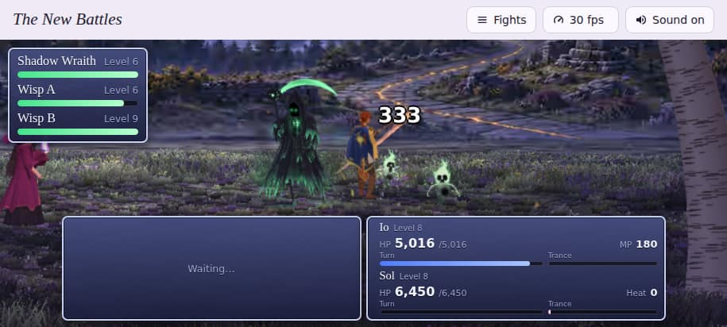 |
| Band 1: the river glade | Band 2: the Warm Roads' moor |
| 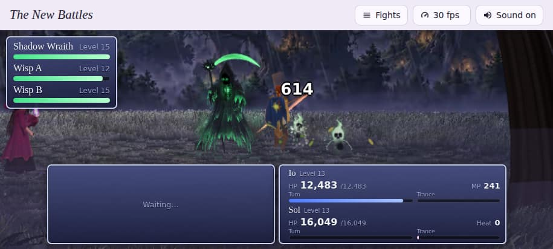 | 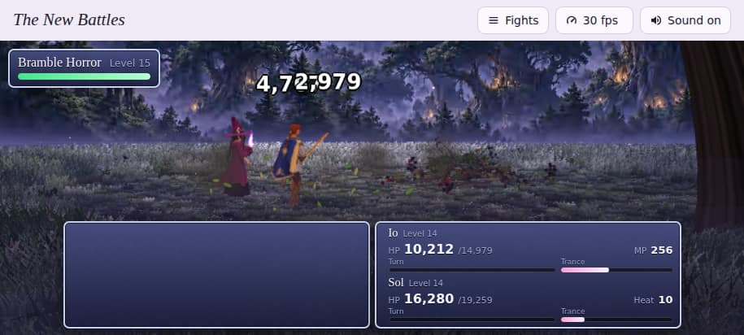 |
| Band 3: Eldergrove, in a storm | The Bramble Horror, Eldergrove |
| 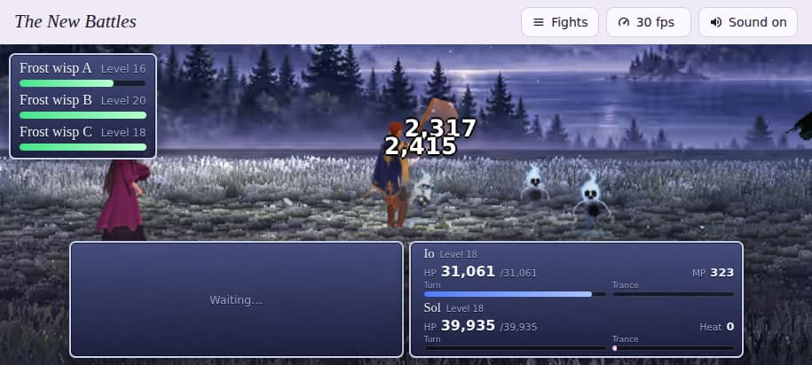 | 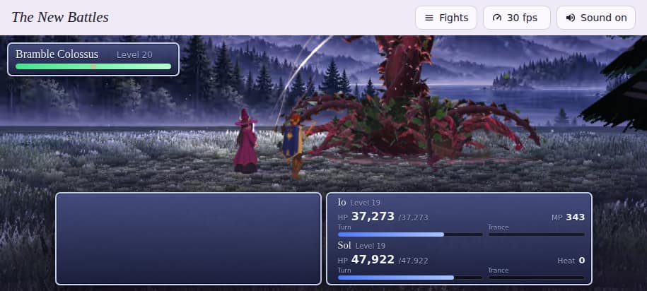 |
| Band 4: Frostmere | The Bramble Colossus, Frostmere |
| 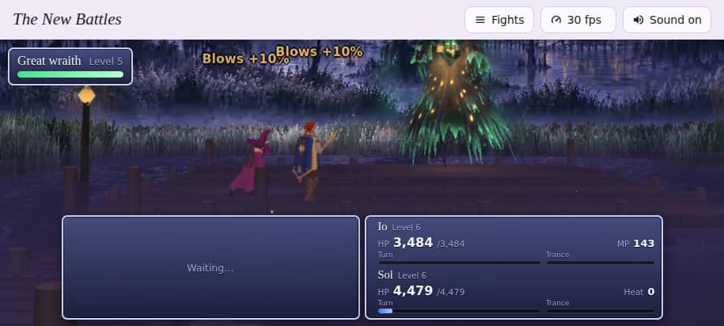 | 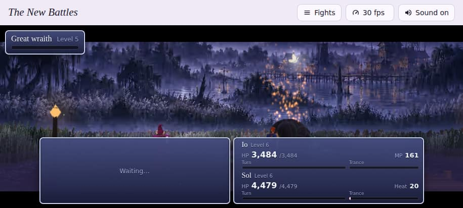 |
| Gate 5: the great wraith at Bogmire | It falls, and the lamplight flies home |
| 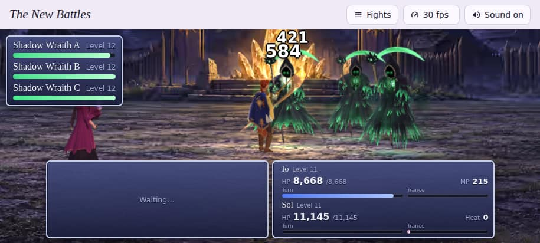 | 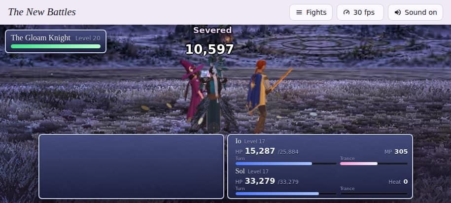 |
| Gate 10: Dawnroost's node | Gate 15: Halcyon at the crossroads |
| 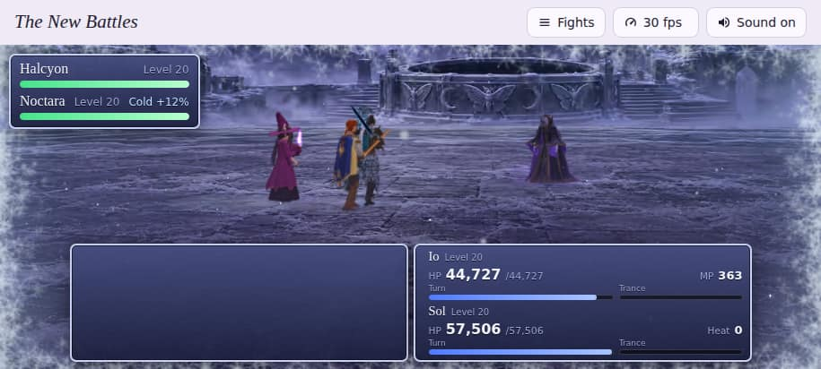 | 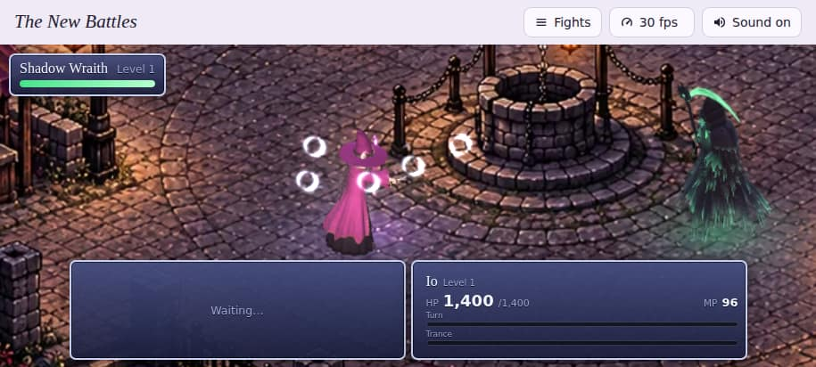 |
| The finale: the dead Moonwell | The first fight, on the Night square's painting as today |

More moments, the same size:

| | |
|---|---|
| 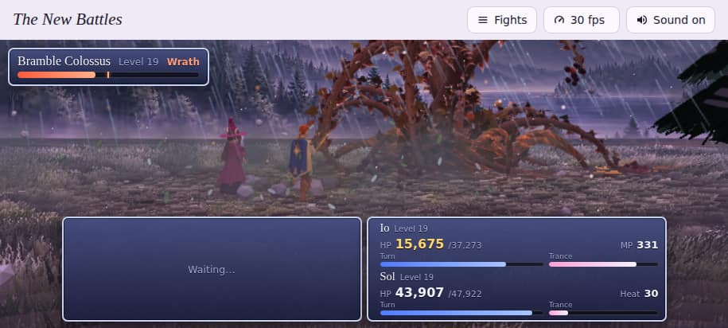 | 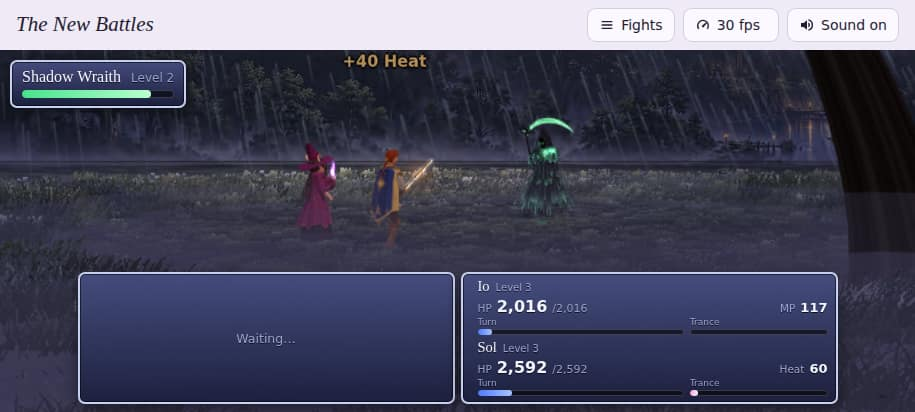 |
| The Colossus's Wrath: a red storm, and the stones it throws up | A storm in the river glade |
| 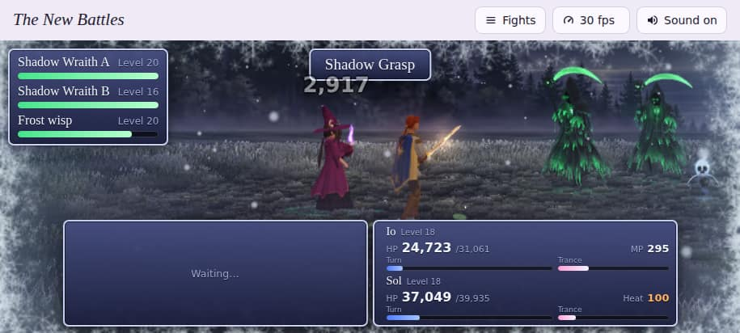 | 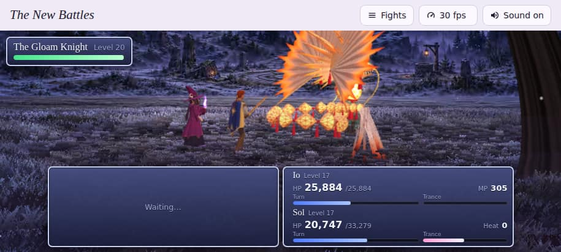 |
| A blizzard by Frostmere | Envoi folds in at the crossroads |
| 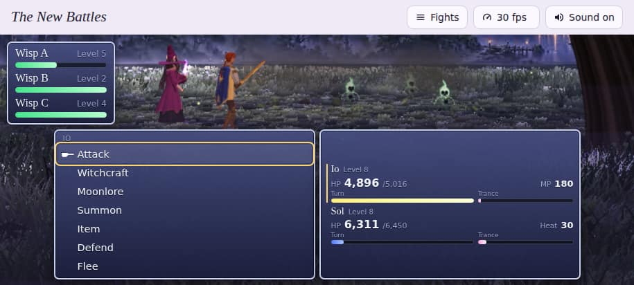 | 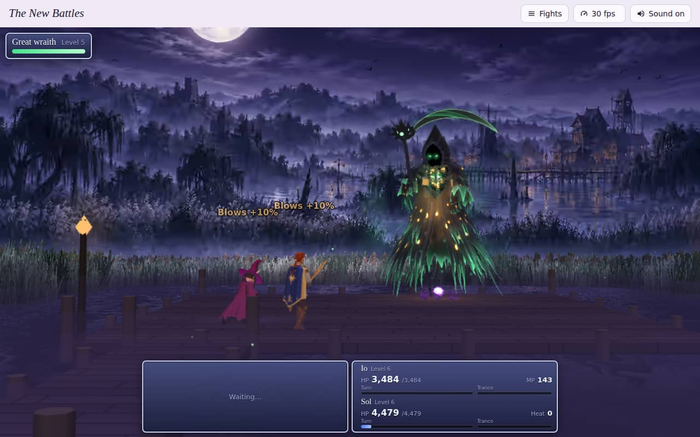 |
| Io's seven commands on the phone: the fight stays above them | Bogmire on a laptop (1280 × 800) |

## Not finished, or worth a look

1. **How fast it runs on your phone** is the one thing the test browser can't tell. The counts above are close to Colossus in the Meadow's, but the busiest fights (gate 10's three wraiths, the finale) ask more of it than the meadow did. If one runs slow, try the **Sharpness** button at Half first (the 3D a little softer, the painting as sharp as ever), and tell the game's session which fight, and whether Half fixed it. The fps button only goes up from 30 (to 45, 60 or the screen's own). The other lever you know from the Battle Backgrounds page, a cap of 24 frames a second (20 froze there), is still a small change if Half isn't enough.
2. **If a fight freezes or goes black on your phone**, the 20 frames a second freeze you saw on the Battle Backgrounds page is the first place to look (it is still unexplained; 20 isn't offered here).
3. **Close-ups are less close** than in today's fights, so that the painting behind never blurs. Say if you'd rather have them closer and a little softer.
4. **The Colossus and the great wraith** are too tall to fit above the menus on the phone in some shots; then their heads go out of the top rather than everyone's feet out of the bottom.
5. **Bogmire's lamps** are found in the painting by their warm colour, in the town beyond the fen, so anything warm there goes dark with them while the great wraith has their light. They come back as the stolen light flies home, a window at a time.
6. **The painted ground shimmers** as the wind's gusts and the blows' shockwaves sweep it, as the meadow's did. If that looks wrong on any painting, it is one number to turn down.

## How it was checked

Headless, in the test browser (Chromium with SwiftShader drawing in software), on October 4 and 5:

- **Every fight on the phone's screen** (915 × 412): each of the eleven started, watched as the expert plays to six seconds of battle, pictured, then counted at the next command. No errors.
- **Every fight on a laptop's screen** (1280 × 800), the same way. No errors, and each frame counts the same as on the phone, within a few draw calls (the same things are drawn).
- **Whole fights to their end cards:** band 2's wilds (won after 4:39 of battle) and the great wraith (won after 7:55, and "Bogmire has its lights back"). No errors.
- **The finale's opening turns**, to 43 seconds of battle, with Lunara risen from the dead Moonwell among the five of them. No errors.
- **The great wraith's fall**, its stolen lamplight flying home and the town's lamps lighting again; **the Colossus's Wrath**; **a storm** in the river glade; **a blizzard** by Frostmere; **Envoi** folding in at the crossroads, summoned by hand. No errors.
- **The game, with the switch off** (measured October 4, before the keepsakes went in): the file you keep, built from this work with the two files it shares with the game (`src/battle/screen.js` and `src/game/fights.js`) put back as they were, is byte for byte yours (SHA-256 `6396cfcc…`), so nothing else here reaches the game. With them as they are now it is 16.31 MB (SHA-256 `96433868…`), and the game test passes: the title, a new game, and a band 2 wild fight at level 8 on the flat Warm Road painting, played to a win and back to the map.
- **The game, with the switch on** (in a copy of the game page that isn't kept): the same test passes, with its band 2 wild fight fought on the Warm Roads' moor and won.
- **The tidy-up and the Sharpness button** (October 5): every place drawn with the arena before and after the tidy-up, on a clear night, in a storm and just after a heavy blow: the same picture, dot for dot, with two draw calls fewer whenever no stones or birds are up. Every fight on the phone's screen before and after, with the same foes and weather (the counts above; both tables are in `../../handoff/tasks.md`, T01), no errors. The Sharpness button pressed round in a fight: the 3D drawn 271, 181, 362 and 271 dots tall on a stage 362 tall (3/4, Half, Full, 3/4). The game with the switch off: the title, a new game, and a band 2 wild fight at level 8 on the flat Warm Road painting at 3/4 sharpness, won; the menu's Settings shows **Battle sharpness** with 3/4 picked, and keeps a pick. With the switch on (a copy of the game page that isn't kept) and Half picked: the same fight on the Warm Roads' moor, its 3D at half sharpness, won. On the phone held upright the header's four buttons take two rows. The balance: 51 of 51 targets.

## Switching the game over

Not done: the game still fights on its flat paintings, and builds as before with the switch off. When you say yes, the game's session does two things:

1. In `src/game/fights.js`, it changes `const ARENA = false;` to `const ARENA = true;`.
2. In `putting-it-all-together/game.html`, right after the line `<script src="../src/fx/battlefield.js"></script>`, it adds these nine lines:

```html
<script src="../src/fx/arena.js"></script>
<script src="../src/stage/arena-river-glade.js"></script>
<script src="../src/stage/arena-warm-roads-moor.js"></script>
<script src="../src/stage/arena-eldergrove.js"></script>
<script src="../src/stage/arena-frostmere.js"></script>
<script src="../src/stage/arena-bogmire.js"></script>
<script src="../src/stage/arena-dawnroost.js"></script>
<script src="../src/stage/arena-crossroads.js"></script>
<script src="../src/stage/arena-dead-moonwell.js"></script>
```

Then it builds the file you keep as always (`node tools/build.mjs --min --offline putting-it-all-together/game.html`) and plays it (`node tools/game-test.mjs --steps title,new,wild --band 2 --level 8`). Every fight but the first is then fought in its arena. It makes the file 0.4 MB bigger (the eight paintings and the arena's code): with the keepsakes in (October 5), the file you keep goes from 17.9 MB to 18.3 MB of its 30, and the published page from 14.5 MB to 14.9 MB as the build counts them (15,574,356 bytes with the tidy-up and the Sharpness setting of October 5, built with `--min` and without `--offline`), under its 16 MB. (An `--offline` build writes a copy to publish too, with three.js and the fonts inside: 16,379,946 bytes. Never publish that one: build with `--min` again after making the file you keep.) Without step 2, step 1 does nothing: a fight whose arena isn't in the page stays on its flat painting.

Both were tried here (How it was checked, above).

## For the next session

The pieces:

| File | What it is |
|---|---|
| `src/fx/arena.js` | The arena: the locked camera, the sheet that brings the painting to life, the live ground (tufts, trees, a boardwalk over water), the air (mist, fireflies, snow, rain, lightning, birds and bats), what a blow throws up, the weather and a Wrath. Made from `living-battlefields/field.js` (the meadow's field, left as it is for the Battle Backgrounds page). |
| `src/stage/arena-*.js` | One per place: its painting, the camera, its skyline and ground line (traced by hand on the painting), its ground, tree, air, weather, lamps, and where Lunara rises and Envoi coils. `arena-river-glade.js` explains the shape. |
| `art/arena/*.avif` | The eight paintings at Strong, copied from `envoi-game-pass-3/battle-backgrounds/img/<number>-q20.avif`. |
| `src/battle/screen.js` | The battle screen's arena mode. Everything it does there hangs on `AF` (the arena), so a flat battle runs exactly as before. Also the 3D's sharpness for every battle, flat or arena: read like the frame rate from this browser (`envoi.sharp`: 1, 0.75 or 0.5; 3/4 unless another is picked) or handed in as `cfg.sharp`, and changed mid-fight by `start(cfg).sharpness(v)` (`renderer.setPixelRatio`, then the stage laid out again). |
| `src/game/fights.js` | The switch (`ARENA`), which arena each fight is fought in (`ARENA_OF`), and where everyone stands there (`ARENA_AT`, in metres). |
| `demos/arena.html` | The demo page, with its Sharpness button (the page keeps the pick in `envoi.sharp` and hands it to each fight). |
| `src/game/game.js` | The game's Settings: **Battle sharpness** (Full, 3/4, Half) beside Battle frame rate, kept in `envoi.sharp` for the battle screen. |
| `tools/arena-test.mjs` | Plays the demo headless, counts what each frame costs (and how many stones and birds were up), checks the Sharpness button, and saves the pictures. `--seed N` makes each fight roll the same foes and weather every run, to compare two versions. |

Building and checking:

```
npm install --prefix tools
node tools/build.mjs demos/arena.html                     # dist/arena.html and dist/arena.artifact.html
node tools/arena-test.mjs                                 # every fight to 6 s of battle at 915x412: errors, draw calls, triangles
node tools/arena-test.mjs --fights band2,gate5 --to end   # whole fights, to their end cards
node tools/arena-test.mjs --fights finale --to turns:4    # the finale's opening turns
node tools/arena-test.mjs --size 1280x800                 # a laptop's screen
node tools/arena-test.mjs --seed 5 [page.html]            # the same foes and weather every run: before and after a change
node tools/arena-test.mjs --jpg envoi-final-draft/arena/renders   # eleven of the pictures: each fight's, named after its place
```

That remakes eleven of the eighteen pictures above: every one in the first table but the lamps coming home. The tool never writes the other seven (the lamps coming home and the six under "More moments"). A storm or blizzard (`--weather storm`) or a laptop's screen (`--size 1280x800`) is saved under the place's own name, over the phone's picture, so make those in another folder and rename them. Run all the fights together: run alone, the Bramble Horror and the Colossus are saved as `eldergrove.jpg` and `frostmere.jpg`. The wilds roll their weather, so a new run may not show Eldergrove in a storm, as its caption says.

This work began from the game at commit `ae4a864`, before the keepsakes and the cutscenes went in. It merges with the game's branch as it stood at `0757ee8` without a clash, and a scratch copy of the two merged was tried: the demo's band 2 and Colossus fights, and the game test with the switch on (its band 2 wild fight on the moor, won). No errors.

On October 5 the game's branch at `0757ee8` was merged into this one (`01456b7`, no clash: the keepsakes' lines in `fights.js` stand beside the arena's), and the branch was pushed as `work/arenas` for the session that is the game's hub from then on (`handoff/relay/arenas.md` on the game's branch). Checked after that merge, headless: the balance (51 of 51 targets), every walking map (`check-maps.mjs`, the keepsakes' places included), the demo built again (2.23 MB) and three of its fights at 915 × 412 (band 2's wilds on the moor in a storm, the Bramble Colossus by Frostmere, and the finale at the dead Moonwell, each to 24 to 30 seconds of battle), with no errors. The game with the switch off builds as before; its own test is in `handoff/relay/arenas.md`. With the switch on, measured in a scratch copy of the game page: the file you keep 18.3 MB, the published page 14.9 MB as the build counts it (15,572,999 bytes; the 15.6 first written here was the `--offline` build's copy, above).

**Brought into the game's branch** on October 5 at `39350b5` by the ultracode hub, with the switch off, after a review of the two shared files by dimension (flat battles, rules and balance, the phone's cost, the docs), which found nothing that changes a flat fight. Its corrections are in this README and in `../../handoff/tasks.md` (T01 part B).

Ideas for later:

- Once the game is switched over, the eight flat paintings the arenas replace (about 2.7 MB of the file) could come out of it; the Night square's stays, for the first fight and the prologue.
- If you ever paint the Night square from eye height, the first fight could have an arena too.
