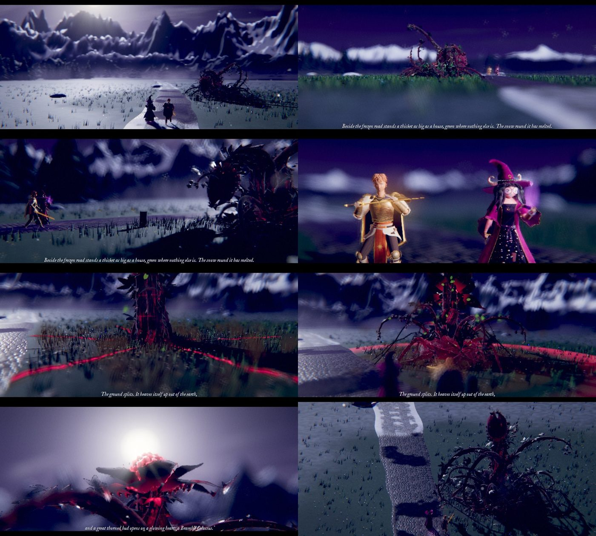

# The Colossus, first met: a cutscene

Made October 4, 2026, evening, from the brief `../briefs/colossus-first-meeting.md`. Everything is in this folder; nothing outside it was changed.

**The page:** https://claude.ai/artifact/GTMr6zTMt5iwoFt5uxG5nY (private). `Colossus_First_Met_Cutscene.html` in this folder is the same page as one file, to open in Chrome, Edge, Firefox or Safari.



## What it shows

The first time Io and Sol meet the Bramble Colossus in the wilds, on the frozen road by Frostmere at night. 45 seconds, skippable, with sound. It ends where the fight begins: everyone standing where the fight stands them, seen through the fight's own camera.

| # | Shot | Seconds | What it shows |
|---|---|---|---|
| 1 | The road | 0 to 7.5 | The moon in a sky with no stars; the camera tilts down to the frozen road, Io and Sol small, walking north up it toward the pass, their breath steaming; the thicket dark beside the road ahead. Wind; an eagle owl far off |
| 2 | The thicket | 7.5 to 13.5 | From its far side, low, the moon behind the camera: a hill of brambles, green where nothing else is, the frost stopping in a ring round it and the road's snow melted where it passes; the two of them small on the road beyond. The first line |
| 3 | It tastes the air | 13.5 to 17.9 | Its red-veined canes at the right, beating with its heart; the two of them walking up the road at the left; one cane lifts and reaches out toward them, then another |
| 4 | Sol stops her | 17.9 to 24 | Io stops. Sol puts out her hand (her Kestrel reach), steps in front of Io into her guard (her guard step), and her sunsteel lights amber. Then the ground starts to shake, and Io braces |
| 5 | It rises | 24 to 33 | The ground splits round it in glowing cracks; spikes, then the spire, then every cane heave up out of the earth, slowed a little; the camera pulls back and up over the two of them to take in all of it. The second line, its first half |
| 6 | The heart | 33 to 39 | Its bud against the moon parts on its glowing heart, steam breathing out of it, moonlight streaming past. The second line, its second half |
| 7 | The hand-over | 39 to 45 | The camera settles into the fight's own framing: Io and Sol lower left, the Colossus upper right, about 8.5 m apart. The letterbox opens and the focus sharpens to the battle's. It holds, then hands over |

It has no throat, so it never roars: its sounds are wood, leaves, soil, roots and air, and the night falls silent when it wakes, as in the field study.

## The words

Only the fight's own two lines (`src/game/fights.js`, the Colossus's `introMsg` and `introAfter`), word for word, as film captions. They are still placeholders for the lore conversation, and they are all in `src/words.js`. The second line is shown in two parts, as it rises and as its bud opens; its parts joined with a space are the game's line.

## The hand-over

The last frame is the fight's own composition, worked out the way the battle screen works it out (`src/battle/screen.js`): the frozen road painting's camera (a 12 degree lens pitched 25 degrees down, at 54 painting pixels a meter, `src/stage/frozen-road.js`), Io, Sol and the Colossus where the fight stands them on that painting (`COLOSSUS_AT` in `src/game/fights.js`), facing as the fight faces them, and the crop the battle's opening shot takes round everyone for this screen (its `shotField`, before the battle's menu shows). On a phone held sideways that crop puts the two of them right at the bottom left, as the battle does. **Skip** lands on the same picture, so the battle takes over from the same frame either way.

**Which painting it matches:** the frozen road's (`reference/art/backdrops/battle-frozen-road.png`, the game's `art/backdrops/battle-frozen-road.avif`): its camera, its ground positions and its crop, exactly. What the 3D shows on that ground is the field study's meadow by Frostmere, which was built after painting 05 (`reference/art/battle-backgrounds/05-ironspire-frostmere-lakeside-meadow.png`). If the fight moves to Frostmere's lakeside meadow in the new battles, `battle` in `src/scene.js` takes that painting's camera and positions, and the last shot follows.

## Into the game

The module is `colossus-first-meeting.js`: everything inside one function, so its copies (the field study's Colossus, Sol, the meadow) never clash with the game's own models of the same names. It defines only `window.CUTSCENES['colossus-first-meeting']`, and needs three.js r128, which the game has.

```js
const C = window.CUTSCENES['colossus-first-meeting'];   // { title, seconds, play, prepare, last }
const why = await C.play(container, { quality: 'phone', volume: { music: 1, effects: 1, surroundings: 1 }, level: 18 });
// why is 'done' or 'skipped'. Everything is freed by then, its WebGL context included (renderer.dispose() and
// renderer.forceContextLoss()); its sound is closed; three.js's fog chunks are put back as they were.
// Its last picture stays in the container as a canvas, .envoi-cs-still, for a cross-fade into the battle: remove it
// when the battle is drawing.
```

- `opts`: `quality` (`'light' | 'phone' | 'laptop'`; a phone gets Phone by default), `volume` (the game's three: Music, Effects and Surroundings; it has no music, its Bramble and Sol sounds are Effects, the wind and the night are Surroundings), `level` (the level the fight meets it at, 16 to 20; its level darkens it and lengthens its thorns; 18 otherwise), `skip` (default true: its own Skip button; Escape also skips), `still` (default true).
- `prepare(container, opts)` builds without playing and returns `{ ready, start(), cancel() }`, for building behind something else and starting on cue; `start()` returns the same promise as `play`.
- It builds in about 8 seconds in the slow test browser (the meadow under 1 s, the cast about 2 s, compiling every shader up front about 5 s, so nothing stalls mid-scene); a phone's graphics chip should be quicker.
- **The quick intro:** the battle's quick intro still plays the foes' `appear` (`intro(quick)` in `screen.js`), so after the cutscene the Colossus would rise a second time. For a seamless hand-over, the game could start the Colossus already standing in its stance when the cutscene has played.
- **The heights the crop uses** are the fight's: Io 2.1 m, Sol 1.9 m, the Colossus 7.8 m tall and 5.4 m wide each side (`FOE_LOOK` and `hero` in `fights.js`). If those change, `battle.field` in `src/scene.js` follows them.

## Detail

| | Light | Phone (a phone's first choice) | Laptop |
|---|---|---|---|
| The Colossus | detail .25, 103k triangles | detail .25, 103k triangles | the field study's High, detail 1, 1.03 M triangles |
| Io (the cutscene Io) | detail .25, 128k triangles | detail .32, 168k triangles | detail 1, 1.23 M triangles |
| Sol (the game's) | 38k triangles | 38k triangles | 98k triangles |
| The meadow | less grass, no reflection in the lake | about half the grass, a cheap reflection every other frame | the field study's High |
| The moon's shadow | 1024 pixels, plain edges | 2048 pixels, plain edges | 4096 pixels, soft edges |
| The picture | 70% sharpness, no smoothing | 80% sharpness, 2× smoothing | full sharpness, 4× smoothing |
| Frames | up to 30 a second | up to 30 a second | as fast as the screen |
| Drawn each frame | about 1.18 million triangles, 145 to 170 draw calls | about 1.33 million triangles, 145 to 170 draw calls | about 6.9 million triangles, 150 to 175 draw calls |

The counts include the moon's shadow and the lake's reflection. If a phone falls under about 25 frames a second for two seconds, it draws the picture a step less sharp (down to 60% at Phone), and the end card says so.

## Numbers

| | |
|---|---|
| Length | 45 seconds |
| The module | 643 KB as written, 402 KB shrunk (esbuild), 150 KB compressed; without three.js |
| The page | 855 KB as one file: the module, the page's start screen and end card, and the game's two fonts (about 210 KB of it), with three.js from cdnjs |
| Build time | about 8.4 s at Phone and 13.6 s at Laptop in the test browser |
| Frames a second, headless at 915 × 412 | Light about 1 (a frame in 0.9 to 1.0 s), Phone about 0.5 (2.0 to 2.2 s), Laptop 0.1 to 0.2 (4.7 to 8.5 s) |

The headless browser draws on four processor cores without a graphics chip, so its frame rates say nothing about a phone (a Pixel 7a's graphics chip is many times faster than that). The end card measures the real number on whatever screen plays it; Chris's Pixel 7a is the one that matters.

## Sound

All made in code when Play is tapped (a browser lets a page make sound only after a tap).

- **The field study's** (`copies/sounds.js`): the wind in the spruce, an eagle owl, the lake ice; and the Bramble's own: canes creaking, its leaves, the ground giving way and its canes bursting up as it rises, its legs coming down, the whole thicket straining, steam breathed out of its bud, its heartbeat when the camera is close. Each move plays its own, placed left or right and near or far by where it is in the picture. The night falls silent once it wakes.
- **This cutscene's own** (`src/sfx.js`): soft footsteps in the frost, Sol's blade lighting (air drawn past it, then a warm hum with a shimmer), and a deep rumble before the ground splits.

## Files

| Path | What it is |
|---|---|
| `Colossus_First_Met_Cutscene.html` | The page, one file |
| `colossus-first-meeting.js` | The module for the game, one file (built) |
| `src/scene.js` | The cutscene as data: the place, the cast, the seven shots, the hand-over and the fight's framing |
| `src/words.js` | Every line it shows |
| `src/player.js` | The player, general: a cutscene is a place, a cast and a list of shots. It builds everything inside the element it is given, plays it through the film camera, and frees everything afterwards |
| `src/cast.js` | The models it may use, how each is built at each detail, and what each needs: the Colossus's move sounds and tremors, the people's walk, breath and footsteps |
| `src/place.js` | The place: the field study's meadow, with the frozen road through it (new: old paving stones under packed snow, wheel ruts, waymarker stones, and the snow melted where the road passes through the warm ring) |
| `src/sfx.js` | Its own sounds |
| `src/page.html`, `src/page.css`, `src/page.js` | The page's source: loading, the start screen (detail and Play), the end card |
| `copies/` | The files it is built from, copied in (below) |
| `tools/build.mjs` | Builds the module and the page: `node tools/build.mjs` (from this folder) |
| `tools/shots.mjs` | Headless pictures of the page at any moment, and its speed |
| `tools/check.mjs` | Checks the page (Play, Skip, the end card, Watch again, each detail) and the module as the game calls it; ends with "all good" |
| `renders/` | A still of every shot at phone size, and all of them together |

## Copies

| Copy | From | Changed |
|---|---|---|
| `copies/colossus.js` | `3d-model-field-studies/bramble-colossus/colossus.js` | nothing |
| `copies/frostmere.js` | `3d-model-field-studies/bramble-colossus/frostmere.js` | marked "cutscene:": room for the road (no grass, flowers or stones on it), less grass at Phone and Light, a cheaper or no reflection in the lake, a smaller shadow map, the moon's shadow following what the camera looks at, and its reflection's picture handed back to be freed |
| `copies/sounds.js` | `3d-model-field-studies/bramble-colossus/sounds.js` | marked "cutscene:": its context, buses and reverb opened to the cutscene's own sounds, and `close()`, so the sound is shut when the cutscene ends |
| `copies/cinema.js` | `3d-model-field-studies/bramble-colossus/cinema.js` (the same file as `3d-cutscenes/cinema.js`) | nothing |
| `copies/io-cutscene.js` | `3d-cutscenes/io-cutscene.js` (the cutscene Io, with her paper doll's face) | nothing |
| `copies/sol.js` | `src/models/sol.js` | nothing; the cutscene turns her colours linear for the film camera's light, as the Io study does for the game's Io |

The player starts from `3d-cutscenes/player.js` and `scenes.js` and the field study's `page.js`, `film.js` and `motion.js` (their shot lists, camera moves, focus, the Colossus's move sounds and its warm ring), written again as one general player; nothing of theirs is copied unchanged. As of the game's branch `ccr-31761774-76j8j3`, October 4, 2026.

## Building and checking

```sh
npm install --prefix tools                                  # from the repository's top folder: three.js, esbuild, the fonts
cd envoi-final-draft/cutscenes/colossus-first-meeting
node tools/build.mjs                                        # writes the module and the page
node tools/check.mjs                                        # must end with "all good"
node tools/shots.mjs /tmp/shots --q phone --size 915x412 at:6.9 shot:road at:37.5 shot:heart handover shot:last
```

`shots.mjs` steps: `at:<seconds>` plays to there and draws, `handover` shows the hand-over as when skipped, `speed:<seconds>` draws that long and reports how fast, `shot:<name>` saves a picture. It needs Playwright.

## Still open

- **Chris's phone:** how fast it runs on the Pixel 7a, which the end card reports. If Phone is slow there, Light is a tap away on the end card.
- **The quick intro's second rise** (above, Into the game): for the game's session.
- **"Puts out an arm":** Sol has no move that holds an arm out to the side, so she uses her Kestrel reach (her hand raised toward it) and then her guard step in front of Io. A new move would be a change to Sol's model, which this folder doesn't make.
- **Footsteps:** the cutscene has soft steps in the frost. Whether the game has footsteps at all is still Chris's call (`envoi-game-pass-3/README.md`); they are one line in `src/cast.js` to remove.
- **The words** are the fight's placeholders, for the lore conversation.
- **The road** is new staging: the brief and the battle say the thicket stands beside the frozen road, and the field study's meadow had no road, so this cutscene lays one through it.
