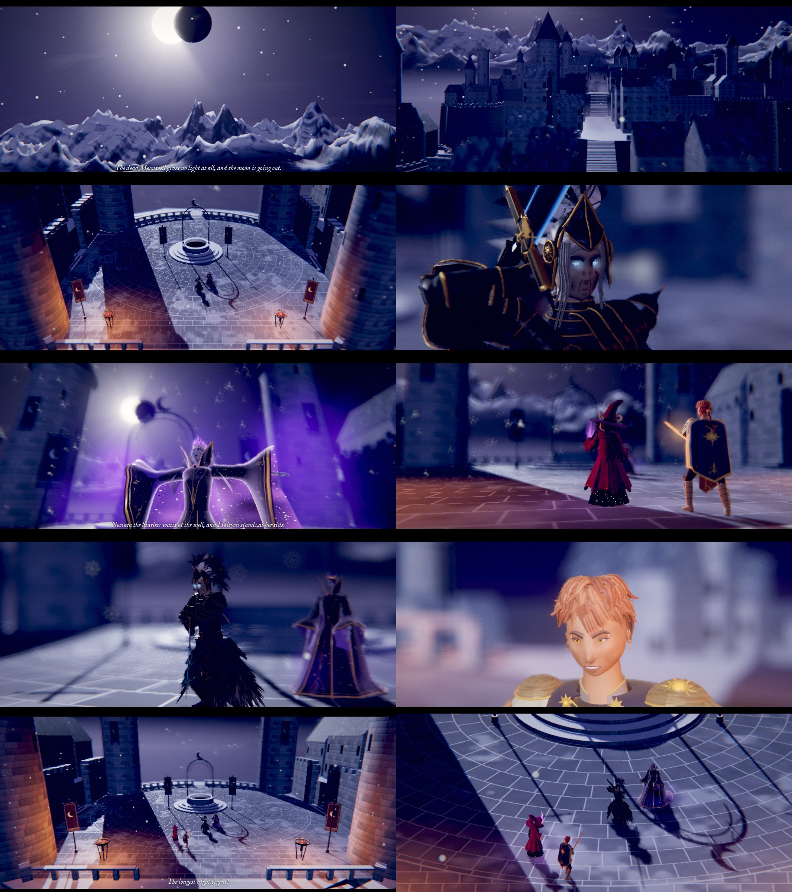

# The finale's opening: a cutscene

Made October 4, 2026, late evening, from the brief `../briefs/finale-opening.md`. Everything is in this folder; nothing outside it was changed.

**The page:** https://claude.ai/artifact/PTwiL7MmnCWkdwA54yHex9 (private). `Finale_Opening_Cutscene.html` in this folder is the same page as one file, to open in Chrome, Edge, Firefox or Safari.



## What it shows

The longest night, at Misthollow's dead Moonwell: the camera comes down out of a sky with no stars, past the moon going out, over the dark town and onto the court where Noctara the Starless waits at the well with Halcyon at her side, as Io and Sol come up the stair. 72 seconds, skippable, with sound. It ends where the last fight begins: all four standing where the fight stands them, seen through the fight's own camera.

The first three shots are one continuous move down from the sky (a single camera path, so the cuts between them never jolt it); the rest are cuts.

| # | Shot | Seconds | What it shows |
|---|---|---|---|
| 1 | The moon going out | 0 to 12 | A sky with no stars; the moon with a black disc biting into it from the east, closing a little more as the whole scene goes on; a slow tilt down onto the Ironspire peaks. The first line |
| 2 | Down over Misthollow | 12 to 26 | Still one move: down over the snowy range and the sea of mist under the town, down among its pale towers, then up its street terrace by terrace between the houses, every window dark, mist low in the streets, snow drifting past the lens |
| 3 | Onto the court | 26 to 36 | Over the last roofs and up the cliff, then down onto the round court from high above: the black well at its heart on its dais, the iron arch and its crescent, the banners, the two braziers burning low, and two figures beside the well |
| 4 | Halcyon | 36 to 42 | Low and close at her side: her blade held up before her, its cold blue edge; the camera rises to her cold blue eyes |
| 5 | Noctara | 42 to 50 | From low in front of her, the eclipse above and to the left of her head and the iron crescent beside it: she opens her arms and lifts her face, the night with its stars opening in her lining, her violet edge light, the dark pouring out over the frost round her. The second line |
| 6 | Io and Sol | 50 to 58 | From behind Io's shoulder on the stair: they climb the last steps into the court and stop at its head, Halcyon and Noctara across the frost before them; Sol's blade lights amber, and Io's witchfire burns up in her hand |
| 7 | Warden's Vow | 58 to 61.4 | Across the court, Halcyon slides into Warden's Vow (`vowStance`), the stance she taught Sol, as Io and Sol walk up |
| 8 | Sol knows it | 61.4 to 64 | Close on Sol's face, the camera walking with her as she slows and stops and raises her guard |
| 9 | The four | 64 to 72 | Low across the frost from the stair head: Io and Sol on one side, Halcyon and Noctara on the other, the dead well between and beyond them, the eclipse above; the camera rises and settles into the battle's own framing, the letterbox opens, and the last line. Halcyon comes out of her stance as the fight would start her. It holds, then hands over |

The brief's shot 7 is made as two (7 and 8): a single camera could not show Halcyon taking the stance and hold on Sol's face too.

## The words

Only the finale's own three lines (`src/game/fights.js`, kind `finale`: `introMsg`, `introAfter` and `attackText`), word for word, as film captions. They are still placeholders for the lore conversation, and they are all in `src/words.js`.

- "The dead Moonwell gives no light at all, and the moon is going out." (over the moon)
- "Noctara the Starless waits at the well, and Halcyon stands at her side." (as Noctara opens her arms)
- "The longest night begins!" (as it settles into the fight's framing)

## The place, and what it was built from

The game has the dead Moonwell only as paintings, so it is built here in code (`src/moonwell.js`), as much as the camera sees on its way in:

- **The court** after the painting the finale is fought on (`reference/art/backdrops/battle-dead-moonwell.png`), laid in the battle's own coordinates so the fight's numbers fit it exactly: dark slate-violet flagstones laid in rings round the well and in courses beyond, frost in their joints, in patches and drifted against the walls; the round well at the back on a three-stepped dais, moths and crescents carved round its rim, black inside and giving no light at all, under an iron arch with chains and a crescent; crescent banners on iron poles (two by the well, two by the braziers, two on the north towers); two braziers at the near corners, coals glowing in their cracks and low flames, the only warm light; stairs on every side; towers all round, the four great round ones at the corners.
- **Its layout** from the walking map (`reference/art/walk/walk-misthollow-moonwell.png`): the round court, the well at its heart, the corner towers, a balustrade along the north open to the peaks, and the main stair coming up from the south, the way Io and Sol arrive.
- **Misthollow below**, after its walking map (`reference/art/walk/walk-misthollow.png`): four walled terraces stepping down to the south, a street of steep-roofed houses up their middle with stairs between them, towers, cliffs and outcrops with arched bridges between them, every window dark (the walking map's are lit; on this night none are), mist low in the streets, and a sea of mist under the whole town, moonlit, lapping at the cliffs.
- **The Ironspire peaks** after art request 11's painting (`reference/art/battle-backgrounds/14-ironhold-misthollow-dead-moonwell.png`): foothills going down into the mist, a great snowy massif behind the court to the north with its highest peak a little east of north, a farther range behind it; snow wherever the slopes can hold it, dark rock on the crags, gullies down the faces, their feet lost in the mist.
- **The sky:** no stars (they come back only at the ending); thin high cloud; the moon, 6 degrees across, a little west of north and 28 degrees up as the paintings have it, with Noctara's black disc crossing it (from 0.38 to 0.66 of the way across over the 72 seconds), darker than the sky; the moonlight thins as it closes. Snow drifts down; breath steams.
- **The light** for the close-ups: the moon's rim light from behind on every face, a cold fill from where the camera stands, the braziers' warmth, Sol's blade and Io's witchfire.

Its cost: the town is merged into a few big pieces by material, and the peaks are a few rings of ground far off with no detail the camera cannot see.

## The hand-over

The last frame is the fight's own composition, worked out the way the battle screen works it out (`src/battle/screen.js`): the dead Moonwell painting's camera (`src/stage/dead-moonwell.js`: a 12 degree lens pitched 26 degrees down, at 54 painting pixels a meter), the four where the finale stands them on that painting (`src/game/fights.js`, kind `finale`: Io at painting pixels 560, 762 and Sol at 630, 812; Halcyon at 750, 690 and Noctara at 828, 642, as the fight's foes come in that order), each side turned toward the other's middle with the looks' own turn toward the camera (`yawBias`), and the crop the battle's opening shot takes round everyone for this screen (`shotField`, with their heights from `FOE_LOOK` and the heroes: Io 2.1 m, Sol 1.9 m, Halcyon 2.11 m, Noctara 2.5 m). The court is laid so that the battle's origin is its middle, so these land on the court as the painting has them: the party lower left, the foes upper right, the well beyond. Halcyon is back out of Warden's Vow and Sol's Heat is back at nothing, as the fight starts them. **Skip** lands on the same picture.

**In an arena** (the new battles; ready ahead of the switch, October 5). Once the game is switched over, the finale is fought at the dead Moonwell's arena, in front of art request 11's painting 14: the fight is seen through the arena's locked camera at eye height instead of the flat painting's from high above (`src/fx/arena.js`, `src/stage/arena-dead-moonwell.js`), with everyone placed in metres (`ARENA_AT.finale` in `src/game/fights.js`). The game then says so when it plays the cutscene (`opts.arena`, from `arenaFor` in `src/game/game.js`: the arena's camera, frame and pixels a metre, and where the four stand there, with their heights), and the last shot ends on the arena's opening frame instead:

- **The camera:** the arena's own, 2 m above the court and 18 m in front of the fight's middle, looking up 4.3 degrees through its 38 degree lens, with the crop the battle's opening shot takes of its 1448 × 1086 frame for this screen (`arenaFrame` in `src/player.js`, worked out as `src/battle/screen.js` works out an arena's `shotField`, `shotFit` and `applyCam` before the menus show: the margins scaled by the place's pixels a metre, the zoom never past half as big again as the widest, the crop allowed below the frame's bottom edge). The camera pulls back to it from the stair head, its lens sliding onto the crop as it comes, so it ends there exactly, with no last jolt.
- **Where everyone stands:** the arena is laid square on the court with Halcyon and Noctara's middle where the painting's fight has it, so the two stand within a step of where they always have (0.3 m: the arena stands them a little farther apart, and turned a few degrees more toward the party, as the battle turns them); Io and Sol walk up from the stair to the arena's places for them, about a metre from the painting's. Its camera then stands out over the main stair, at eye height above the court. Nothing else in the cutscene changes.
- **In the game,** the fight opens on that same picture: after a cutscene, an arena fight first holds everyone in that field shot, its menus not yet up, while the cutscene's last picture fades into it; then its menus come up. The game fades the picture only once the battle has drawn that frame (`cfg.game.shown`, which `intro` in `src/battle/screen.js` calls once that frame is drawn: the first one also builds the foes' shaders, which can take a second, and a fade begun before it would uncover the frame before, a close-up on Io). With the arenas switched on, `tools/game-test.mjs`'s `finale` step checks that the fight opened on the cutscene's last lens and crop exactly.

Without `opts.arena` (the game as it is, with the arenas switched off) nothing changes: the flat painting's frame, exactly as before. `tools/check.mjs` checks both: the flat last picture against its camera, crop and places as they were before the arenas, and the arena's with the arena worked out by the game's own sources (`GameFights.config` with `opts.arena`, then `Game.arenaFor`). `arenaFrame` copies the battle screen's rules for its opening crop (`shotField`, `shotFit`, `applyCam`, with `ZK`, `ZMAX` and `BELOW`): a change to them in `src/battle/screen.js` is a change in both cutscenes' `src/player.js` too, and both modules rebuilt.

## Into the game

The module is `finale-opening.js`: everything inside one function, so its copies (Sol, Halcyon, Noctara, the cutscene Io) never clash with the game's own models of the same names. It defines only `window.CUTSCENES['finale-opening']`, and needs three.js r128, which the game has.

```js
const C = window.CUTSCENES['finale-opening'];   // { title, seconds, play, prepare, last }
const why = await C.play(container, { quality: 'phone', volume: { music: 1, effects: 1, surroundings: 1 } });
// why is 'done' or 'skipped'. Everything is freed by then, its WebGL context included (renderer.dispose() and
// renderer.forceContextLoss()); its sound is closed; three.js's fog chunks are put back as they were.
// Its last picture stays in the container as a canvas, .envoi-cs-still, for a cross-fade into the battle: remove it
// when the battle is drawing.
```

- `opts`: `quality` (`'light' | 'phone' | 'laptop'`; a phone gets Phone by default), `volume` (the game's three: its low drone is Music; footsteps, Sol's blade, Halcyon's stance and Noctara's rite are Effects; the wind, the well's hush, the braziers, the frost, the banners and the bell are Surroundings), `skip` (default true: its own Skip button; Escape also skips), `still` (default true), `arena` (the fight's arena, which the game gives once the arenas are switched on: the last shot then ends on the arena's opening frame; "The hand-over", above).
- `prepare(container, opts)` builds without playing and returns `{ ready, start(), cancel() }`; `start()` returns the same promise as `play`.
- `last`, after a run: how it went (its result, frame rate, detail and so on) and `camera`, its last picture's lens and crop (`{ fov, aspect, view }`), which `tools/game-test.mjs` compares with the fight's opening once the arenas are on.
- It builds in about 7 to 10 seconds in the slow test browser (the place under half a second, the cast 1 to 3 s, compiling every shader up front about 5 s, so nothing stalls mid-scene).
- **The quick intro:** the battle's intro still plays the foes' `appear` (`intro(quick)` in `screen.js`), so after the cutscene Halcyon and Noctara would rise out of the dark a second time. For a seamless hand-over, the game could start them already standing when the cutscene has played, and skip `introMsg` and `introAfter`, which the cutscene has shown.
- **High-detail studies:** none of Sol, Halcyon or Noctara exists yet in `3d-model-main-characters/` (only Io's). When one does, with the game model's interface, it swaps in on its `study` line in `src/cast.js`.

## Detail

| | Light | Phone (a phone's first choice) | Laptop |
|---|---|---|---|
| Io (the cutscene Io) | detail .25, 128k triangles | detail .34, 184k triangles | detail 1, 1.23 M triangles |
| Sol, Halcyon, Noctara (the game's) | their lightest, 38k, 35k and 23k triangles | the same | full, 98k, 89k and 83k triangles |
| The place | about half of Laptop's: plainer towers and well, fewer houses and towers on the outcrops, coarser peaks, less mist and snow | about three quarters of Laptop's | everything |
| The moon's shadow | 1024 pixels, plain edges | 2048 pixels, plain edges | 4096 pixels, soft edges |
| The picture | 70% sharpness, no smoothing | 80% sharpness, 2× smoothing | full sharpness, 4× smoothing |
| Frames | up to 30 a second | up to 30 a second | as fast as the screen |
| Drawn each frame | about 0.57 to 0.58 million triangles | about 0.70 to 0.72 million triangles | about 3.1 million triangles |

Draw calls: 170 to 280 a frame at every detail (the moon's shadow included). If a phone falls under about 25 frames a second for two seconds, it draws the picture a step less sharp (down to 60% at Phone), and the end card says so.

## Numbers

| | |
|---|---|
| Length | 72 seconds |
| The module | 698 KB as written, 445 KB shrunk (esbuild), 165 KB compressed; without three.js |
| The page | 911 KB as one file: the module, the page's start screen and end card, and the game's two fonts, with three.js from cdnjs |
| Build time | about 6.7 s at Light, 7.8 s at Phone and 9.8 s at Laptop in the test browser |
| Frames a second, headless at 915 × 412 | Light about 2.5 (a frame in 0.38 to 0.39 s), Phone about 1 (0.73 to 1.16 s), Laptop about 0.3 (1.9 to 3.7 s) |

The headless browser draws on four processor cores without a graphics chip, so its frame rates say nothing about a phone. At Phone it draws this cutscene about twice as fast as the Colossus's at Phone, with about half the triangles. The end card measures the real number on whatever screen plays it, and also shows these headless numbers; Chris's Pixel 7a is the one that matters.

## Sound

All made in code when Play is tapped (`src/sound.js`), through one reverb shaped like a stone court high among mountains:

- **Beds:** the wind over the peaks in gusts with a thin whistle high in it, loudest in the sky and dropping as the camera comes down; the empty well's hush, a low hollow breath out of nothing, rising as the court comes near; a low drone for music (the Music volume); the braziers burning low, heard near them.
- **One-shots:** frost cracking in the cold and a banner snapping in a gust, now and then; footsteps on frosted stone; Sol's blade lighting; Halcyon's blade turning as she takes her stance; Noctara's rite as she opens her arms, a low swell with a cold shimmer; and a great bell far down in Misthollow, tolling once as the longest night begins.

## Files

| Path | What it is |
|---|---|
| `Finale_Opening_Cutscene.html` | The page, one file |
| `finale-opening.js` | The module for the game, one file (built) |
| `src/scene.js` | The cutscene as data: the place's settings, the cast, the camera's path down from the sky, the nine shots, the hand-over and the fight's framing |
| `src/words.js` | Every line it shows |
| `src/player.js` | The player, general (the Colossus cutscene's, with a camera path across shots, a sound engine of the scene's own, and a cue to bring someone out of a held move) |
| `src/cast.js` | The four, how each is built at each detail, and what each needs: walk, breath and footsteps; Sol's and Halcyon's glowing blades kept right in the film camera's light |
| `src/moonwell.js` | The place: the court, Misthollow, the peaks, the sky and the eclipse, the light, the mist and the snow |
| `src/sound.js` | Every sound |
| `src/page.html`, `src/page.css`, `src/page.js` | The page's source: loading, the start screen (detail and Play), the end card |
| `copies/` | The files it is built from, copied in (below) |
| `tools/build.mjs` | Builds the module and the page: `node tools/build.mjs` (from this folder) |
| `tools/shots.mjs` | Headless pictures of the page at any moment, and its speed |
| `tools/check.mjs` | Checks the page (Play, its sounds, Skip, the end card, Watch again, each detail) and the module as the game calls it, on the flat painting and in an arena; ends with "all good" |
| `renders/` | A still of every shot at phone size (`phone-*.jpg`, 915 × 412, Phone detail) and laptop size (`laptop-*.jpg`, 1280 × 720, Laptop detail), the hand-over last, and each set together (`shots-phone.jpg`, `shots-laptop.jpg`) |

## Copies

| Copy | From | Changed |
|---|---|---|
| `copies/io-cutscene.js` | `3d-cutscenes/io-cutscene.js` (the cutscene Io, with her paper doll's face) | nothing |
| `copies/sol.js` | `src/models/sol.js` | nothing |
| `copies/halcyon.js` | `src/models/halcyon.js` | nothing |
| `copies/noctara.js` | `src/models/noctara.js` (her approved second pass) | nothing |
| `copies/cinema.js` | `3d-model-field-studies/bramble-colossus/cinema.js` (the same file as `3d-cutscenes/cinema.js`) | nothing |

The game's models are painted for a plain renderer, so the cutscene turns their colours linear for the film camera's light, as the Io study does for the game's Io (`src/cast.js`); the models themselves are as they are. `src/player.js` starts from this project's Colossus cutscene (`../colossus-first-meeting/src/player.js`). Everything else is new. As of the game's branch `ccr-31761774-76j8j3`, October 4, 2026 (nothing these copies come from has changed on it since).

## Building and checking

```sh
npm install --prefix tools                                  # from the repository's top folder: three.js, esbuild, the fonts
cd envoi-final-draft/cutscenes/finale-opening
node tools/build.mjs                                        # writes the module and the page
node tools/check.mjs                                        # must end with "all good"
node tools/shots.mjs /tmp/shots --q phone --size 915x412 at:7 shot:moon at:46 shot:noctara handover shot:last
```

`shots.mjs` steps: `at:<seconds>` plays to there and draws, `handover` shows the hand-over as when skipped, `speed:<seconds>` draws that long and reports how fast, `eval:<js>` runs a line against its test hooks, `shot:<name>` saves a picture. It needs Playwright.

## Still open

- **Chris's phone:** whether Phone holds about 30 frames a second on the Pixel 7a, which the end card reports. If it doesn't, Light is a tap away on the end card.
- **The quick intro's second rise**, and its two lines shown again (above, Into the game): for the game's session. Done by the game's session on October 4, late evening: after the cutscene the foes start standing and the fight's lines aren't said again (`../README.md`, "Into the game").
- **Halcyon's planted blade:** her model has no standing pose with the blade planted in the frost (only her defeat, kneeling on it, which belongs to the ending), so shot 4 shows her blade held up before her, from low, and rises to her eyes. A planted-blade stance would be a new move in her model, which this folder doesn't make.
- **Noctara's rite:** she lifts her face to the eclipse with her own Blackout move (arms open, face up, the night opening in her lining, the dark pouring out round her), played once and released; in the cutscene it strikes nothing. If Blackout should be kept for the fight, a quieter move would be new to her model.
- **Music:** a low drone of its own. The brief's other choices, the game's "Beneath the Stone" (`src/game/thareia-audio.js`) or Chris's songs, are for the game's session: the module doesn't start the game's own music, which is shared with the rest of the game.
- **Footsteps:** soft steps on the frost, as in the Colossus cutscene; whether the game has footsteps at all is still Chris's call, and they are one line each in `src/cast.js`.
- **The words** are the finale's placeholders, for the lore conversation.
