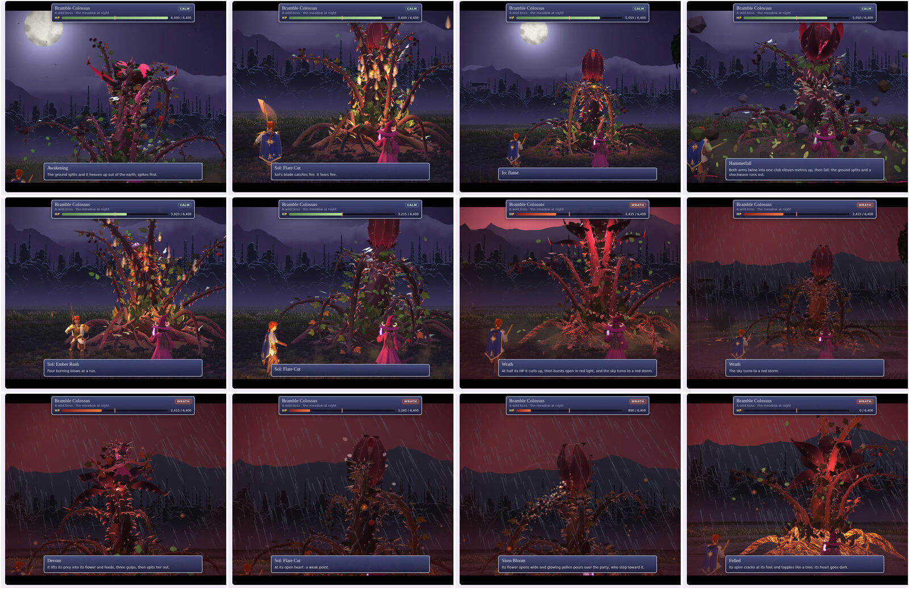
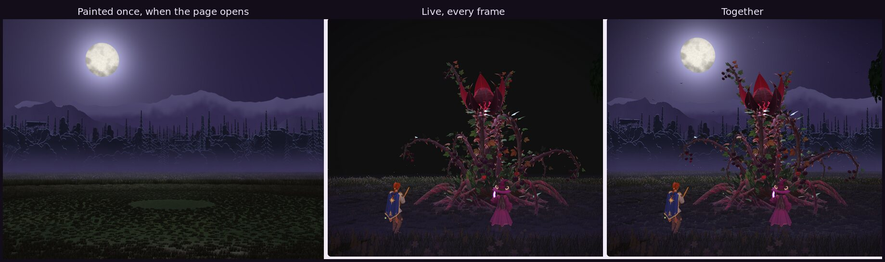
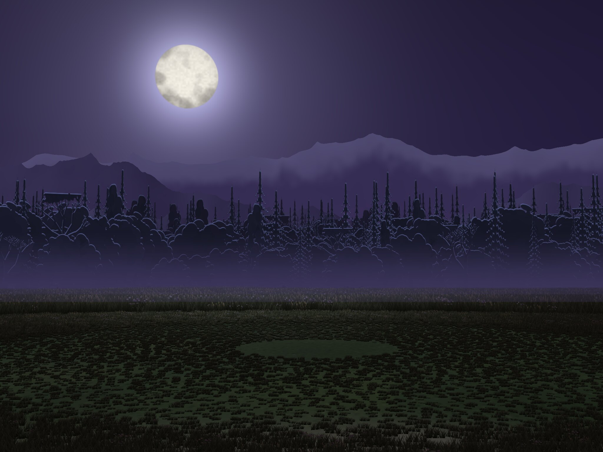

# Living Battlefields

Chris asked, on October 3, 2026: if the battle camera is locked behind the party, does that make it cheap enough to put a living 3D place on top of a painted background? Could towns keep their paintings with a little weather, and the wilds have painted trees far off with generated grass in front? Would the whole game still fit in one HTML file of about 30 MB? And could a fight between Io, Sol and the Bramble Colossus be made as epic as possible, background, effects and sound included?

This folder is the answer: a fight page, **Colossus in the Meadow**, and the two pieces it is made of, a locked-camera battlefield (`field.js`) and sounds made entirely in code (`sfx.js`).

**The page:** https://claude.ai/artifact/KCMQSy3QksJbZ4ikquxYVj (private; it works on a phone). `Colossus_Fight.html` in this folder is the same page as one file. Tap **Play the fight**: about a minute, from the Colossus heaving up out of the meadow to its fall.



## The short answers

- **Locking the camera makes it much cheaper.** Nothing the camera can't see is ever made. Everything far off is drawn only once, when the page opens, into one picture. Every frame afterwards costs no more than showing a flat picture. The meadow that moves (the grass near enough to sway, a tree, mist, fireflies, rain, everything thrown up) now costs a fifth of what the old wild meadow did: 19,500 triangles instead of 95,000. Meanwhile the picture holds about four times as much grass and over a thousand trees.
- **3D on top of a painting works.** It is how the game's battles already work: the Night square is a painting, and the characters stand in it because the 3D camera matches the painter's. What's new here is that the painting itself can move a little. The page knows where every pixel of it lies on the ground, so it can:
  - drift clouds over the moon and roll a storm in over the sky;
  - light it with lightning;
  - sweep gusts and shockwaves through its grass;
  - darken it in the rain and ripple its puddles;
  - crack and scorch it where blows land;
  - light the ground round a fire or a spell.
- **Towns:** keep their paintings, and add weather and life over them: rain, snow, mist, smoke from chimneys, flickering lamplight, lightning, birds. It is cheap, because none of it has to be modelled.
- **The wilds:** a painting of the far forest and mountains, with grass, bushes and a tree or two in 3D in front of it, so the near ground answers the fight.
- **The whole game in one file: yes, easily.** This page is 0.6 MB, and nearly all of that is the three models' code. The painting is made in code, so it costs nothing in the file. A painted picture instead would be about 0.5 to 1 MB. The sounds are 35 KB of code. A 30 MB file has plenty of room left for paintings, portraits and songs. The real limit is how much the phone's graphics chip can draw in each frame, not the file's size.
- **Sound:** every sound is made in code when you press Play, with no recordings:
  - 44 effects: the Colossus's shrieking roars and growls, the smash of Hammerfall with its crack, crunch and rattle of falling stones, splintering wood as it falls, whip cracks, thorn rain, fire, blades on wood, bells and thunder;
  - four loops under them that follow the weather: wind, rain, insects at night, and a storm's rumble.
  
  They take under a second to make. Chris's songs still go in last; these are only effects.

## How the page is put together



- **One locked camera.** It looks at the fight from behind the party (`field.camera`). A shot is a crop and a zoom of its frame, as the battle screen's shots are of its painting (`setViewOffset`). On a phone held upright, the page shows a tall slice of the frame and moves it to follow the action. The shake, the zoom punches on big blows, the slow motion of Hammerfall and the hit-stops all happen inside the frame.
- **The painting** (`field.js`, the first half). Drawn once into a picture the size of the frame (2048 × 1536):
  - the night sky, with a big moon, stars and the Milky Way;
  - three mountain ranges, the far one snow-capped;
  - 1,092 trees of eight kinds round the meadow, hazier further off, each with a rim of moonlight;
  - the ground, and 32,250 tufts of grass out to the forest.
  
  A second picture records what each pixel is (sky, a far thing, or ground) and how far off it is. The shader that shows the painting reads it to bring the picture to life.
- **The live layer** (`field.js`, the second half), made only inside the frame:
  - 4,578 tufts of grass out to 40 m, each a card turned to face the camera and drawn nearest first, so grass hidden behind grass costs little; they bend in the wind and to shockwaves, darken where they are scorched, glow at their tips with the moon behind them, and take the light of fires and spells;
  - an old oak at the frame's right edge;
  - three layers of drifting mist that shockwaves blow holes in, and 130 fireflies;
  - 1,100 particles (leaves, petals, turf, dust, smoke, embers, sparks and splashes), and 140 rocks and clods that fly, bounce and settle;
  - rain, and lightning in the sky and down into the meadow;
  - birds that a roar puts up out of the forest.
- **The fight** (`fight.js`) keeps the Colossus bench's rules and moves: its blows, its Wrath at half its HP, its weak point while its flower is open, and its fear of fire. Io and Sol are the game's models, as this branch has them (`../src/models/witch.js` and `sol.js`); once this branch and the game's are together, the page takes their polished versions without a change. Io's flame and Waxing Light and Sol's sword use the battle screen's own effects (`../src/fx/battle-fx.js`, `io-spells.js`). **Play the fight** plays a fixed sequence with fixed numbers, so it runs the same way every time:
  1. Awakening;
  2. Sol's Flare Cut, and Thorn Lance on Sol;
  3. Io's flame;
  4. Hammerfall on Io, then Io's Waxing Light;
  5. Ember Rush, Thorn Volley and Io's dagger;
  6. Sol's Flare Cut takes it under half its HP: Wrath, and the sky turns to a red storm;
  7. a red lightning bolt into the meadow, then Maelstrom;
  8. Devour on Io, until Sol's Flare Cut at its bare heart makes it let go;
  9. Thornwood on Sol, Sol's Sunder and Siren Bloom;
  10. Sol's High Noon, and it is Felled; the storm clears.
  
  The moves can also be played one at a time, with any weather.
- **The sounds** (`sfx.js`) are rendered once into buffers with an offline audio context, from oscillators, filtered noise, grains and resonators:
  - roars through three formant filters (the throat), with a shriek of three detuned voices gliding up;
  - smashes from a falling sine under a crack, crunching earth and dozens of tiny stones;
  - wood from struck resonances;
  - bells by FM, and metal from the partials of a struck bar.
  
  Each sound plays panned to where it happens on the screen, through a reverb made in code; the loudest ones hush the meadow for a moment.

## Using a painted picture

The page can use a painting instead of the one it draws:

1. **See the painting** (in What it costs) shows the page's own painting; press and hold it, or Download it. The same picture is `renders/painting-guide.jpg`.
2. Give it to the image generator as the starting picture, with the prompt in art request 08 (`../docs/art-requests/08-painted-meadow-backdrop.md`). The painting has to keep the guide's layout: the horizon, the forest's edge, where the moon is.
3. **Use my painting** puts a picture from the phone in place of the page's own, at once. The grass near enough to move, the tree, the mist, the weather and the fight stay live in front of it. **The code's own** goes back.



## Numbers

| | Locked frame (this page) | The wild meadow, whole (`../3d-model-new-character-ideas/bramble-horror/meadow.js`) |
|---|---|---|
| The place, live: draw calls | 25 | 16 |
| The place, live: triangles | 19,500 | 95,000 |
| Painted once | 32,250 tufts, 1,092 trees, mountains, moon and stars | — |
| The whole frame, with the Colossus, Io and Sol | 96 draw calls, 319,000 triangles | 94 draw calls, 394,000 triangles |
| Painting it | 6 s in a headless browser that draws without a graphics chip; the page shows the time it took on the phone | — |
| Code | 88 KB (`field.js`), 35 KB (`sfx.js`), 40 KB (`fight.js`) | 65 KB |
| The page, one file | 0.6 MB (three.js loads from the web) | — |

The extra draw calls are layers that cost little when they have nothing to draw: rain, lightning, the debris, three kinds of particle. The page shows its frame rate. **60 frames** lifts the 30-a-second cap that the game uses, to see how far the phone can go.

## Files

| Path | What it is |
|---|---|
| `colossus-fight.html`, `fight.js`, `fight.css` | The fight page's source (it also uses the creature benches' `bench.css` and the Colossus bench's `boss.css`) |
| `field.js` | `makeLivingField(opts)`: the locked-camera meadow, painted once and alive in front |
| `sfx.js` | `makeFightSound()`: every sound made in code; its names match the game's `src/battle/sound.js` where they overlap |
| `Colossus_Fight.html` | The built page, one file |
| `renders/` | The fight, the layers, and the painting guide |

To rebuild the page after changing its files, from the repository's top folder:

```sh
node tools/build.mjs living-battlefields/colossus-fight.html
cp dist/colossus-fight.html living-battlefields/Colossus_Fight.html
```

## Still open

- **Into the game.** The battle screen on the game's branch (`src/battle/screen.js`) could take this for the Colossus's fight, as the handoff note there plans for living battlefields. That needs this branch and the game's branch to be together first.
- **Chris's painted backdrop** for the meadow (art request 08), and paintings for other places.
- **No stars.** The fight's sky has only the moon, because the stars only come back at the ending (lore answers 5 and 10). The wild meadow on the creature benches still shows stars at night; it should lose them before any of it goes into the game.
- **Towns:** the same painting-plus-weather approach over the town paintings, without the 3D grass.
- **The Gloamwing and the Emberback** could fight here too, once their models are built.
